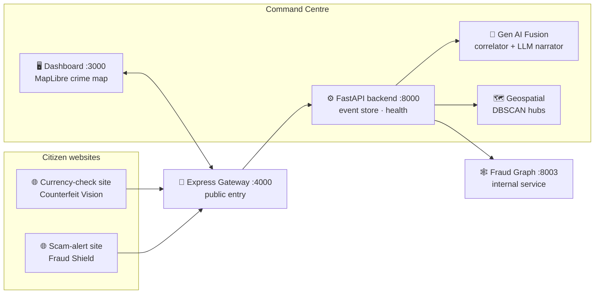

<div align="center">

# 🛡️ AEGIS AI

### Digital Public Safety Intelligence Platform

**Three AI systems. One correlated picture. Every verdict carries its evidence.**

*ET AI Hackathon 2026 · Problem Statement #6 — Defeating Counterfeiting, Fraud & Digital Arrest Scams*
Theme: Smart Cities · Public Safety · Digital Trust · Geospatial Law Enforcement

</div>

---

## The problem

> India logged **1.14 million cybercrime complaints in 2023** — up 60% year-on-year.
> "Digital arrest" scams — fraudsters posing as CBI/ED/Customs on video calls — stole
> **₹1,776 crore in just nine months of 2024.** Counterfeit ₹500 notes now beat manual bank
> checks. RBI flagged record fake-note seizures in 2025.

Police see each of these crimes **in isolation** — a scam call here, a fake note there, a mule
account somewhere else. There is no intelligence layer *before* mass victimization, and nothing
connects scam detection + counterfeit detection + fraud networks into one picture.

**Aegis is that layer.**

---

## The solution — 4 modules, 1 command centre

| Module | What it does | AI type | Lead | Status |
|---|---|---|---|---|
| 🗣️ **Fraud Shield** `:8001` | Real-time scam / digital-arrest call & message classifier | Supervised NLP | Sudarsan | ✅ ROC-AUC **0.984**, scam precision **0.97** |
| 💵 **Counterfeit Vision** `:8002` | Fake-note detection naming the *missing* security feature | CNN + OpenCV | Adharshan | ✅ ROC-AUC **0.96**, fake precision **1.0** |
| 🕸️ **Fraud Graph** `:8003` | Graph ML clustering accounts into fraud rings | Graph ML | **Prayag** | ✅ **0.9945 AUC on real Elliptic++**, 12/12 rings |
| 🎛️ **Command Centre** `:8000/:4000/:3000` | Dashboard + crime map + **Gen AI fusion** tying it all together | Gen AI / agentic | Pushkar (+ Prayag) | ✅ live, all paths verified |

---

## 🎯 The three wow moments — all live-demoable

1. **📞 Scam call** read out loud → flagged instantly at **99.9% risk**, with the digital-arrest
   markers that triggered it (authority impersonation, fake FIR, video-call isolation…).
2. **💵 Note** held to a camera → verdict **FAKE ₹500** with the *specific* missing security
   feature named (security thread / watermark / microprint).
3. **🧠 The fusion moment** → press **RUN FUSION** and the dashboard auto-writes:
   > *"This scam call is linked to a fraud ring active in Jamtara, where a counterfeit ₹500
   > note was also seized."* — **threat: CRITICAL**

> All three verified end-to-end through the command centre, on both synthetic and real data.

---

## 🧠 Three defensible innovations

**1 · The fusion itself.** No product combines scam + counterfeit + fraud-graph signals. The
correlation engine is **deterministic and auditable** — links require concrete evidence (same
district, ≤30 km, ≤96 h). The LLM only *narrates* established links; it can never invent one, and
`audit_trail.inputs_hash` makes every intelligence package reproducible. *(This is what the
problem statement calls "Agentic AI for multi-source intelligence fusion.")*

**2 · Self-improving classifier.** An LLM red-teams Fraud Shield — it writes *next year's* scam
scripts, including whole families the model was never trained on (investment fraud, job-task
scams). Half augment training, half are held out as unseen future scams.
**Recall on held-out variants jumps 69% → 100%, with zero human labelling.**

**3 · Cross-domain crime map.** Scam origins and counterfeit seizures on one map; a **DBSCAN**
hotspot where *independent detection systems converge* is flagged as a coordinated crime hub.

---

## 🏆 Why we win

- **Innovation + Business Impact = 50% of judging** — the fusion layer and geospatial overlap hit
  both, and almost nobody else will build the convergence layer.
- **Auditability for legal admissibility** is a *named* evaluation metric — every verdict ships
  with its evidence: marker spans (NLP), per-feature check scores (CV), feature importances
  (graph), correlation basis + reproducible hash (fusion).
- **Low false-positive rate** is a stated requirement — every module thresholds **precision-first**
  from its PR curve; a note is never certified genuine while a security check fails; `legit`
  verdicts are excluded from correlation entirely.
- **Real-data validated** — Fraud Graph scores **0.9945 AUC on the Elliptic++ Bitcoin benchmark**
  (823k wallets), not just on toy data.
- **The demo cannot die** — the LLM narrator fails over Claude → Groq → Gemini → deterministic
  template; every service degrades gracefully; map tiles are keyless.

---

## 🏗️ Architecture — the 3-website setup

Two citizen-facing sites feed an Express gateway; a police/analyst command centre consumes
everything. Full diagrams in [`docs/architecture.md`](docs/architecture.md).



**The only coupling between modules is JSON.** Detection modules never import each other — they
emit contract-validated JSON ([`contracts/`](contracts/)), and the command centre consumes it.
Four people built in parallel with near-zero merge conflicts because of it.

---

## 🚀 Run the whole stack

Each service is self-contained; start any subset — the dashboard degrades gracefully.

```bash
# 1 · Fraud Shield (NLP) — train once, then serve            → :8001
cd fraud-shield-nlp && pip install -e ".[dev]"
python -m aegis_fraud_shield.cli train
uvicorn aegis_fraud_shield.api:app --app-dir src --port 8001

# 2 · Counterfeit Vision (CV) — generate + train once        → :8002
cd counterfeit-vision && pip install -e ".[dev]"
python -m aegis_counterfeit.cli generate && python -m aegis_counterfeit.cli train
uvicorn aegis_counterfeit.api:app --app-dir src --port 8002

# 3 · Fraud Graph (Graph ML)                                 → :8003
cd fraud-graph-ml && uv venv && uv pip install -e ".[dev]"
fraud-graph demo          # train + detect + contract-validate (CLI)
fraud-graph serve         # API for the command centre

# 4 · Command-centre backend (aggregator + Gen AI fusion)    → :8000
cd command-centre/backend && uv venv && uv pip install -e .
uvicorn aegis_command.api:app --app-dir src --port 8000

# 5 · Express gateway (public entry for citizen sites)       → :4000
cd command-centre/gateway && npm install && npm start

# 6 · Dashboard (Next.js 15 + MapLibre crime map)            → :3000
cd command-centre/frontend && npm install && npm run dev
```

**Gen AI narrator (optional but recommended):** drop a key in
`command-centre/fusion/.env` — `GROQ_API_KEY=...` (free & fast), `GEMINI_API_KEY=...`, or
`ANTHROPIC_API_KEY=...`. Without any key, a deterministic template narrator keeps the demo alive.

> Ports 8001/8002 also serve their own **live demo UIs** (scam chat / camera scanner) at `/`.

---

## 📁 Repository layout

```
Aegis/
├── contracts/              📜 JSON schemas + samples every module codes against (the interface)
├── fraud-shield-nlp/       🗣️ Sudarsan  — marker rules · TF-IDF⊕marker LogReg · chat UI      :8001
├── counterfeit-vision/     💵 Adharshan — synth renderer · OpenCV checks · EfficientNet-B0    :8002
├── fraud-graph-ml/         🕸️ Prayag    — 18 graph features · XGBoost · Louvain rings ⭐        :8003
├── command-centre/
│   ├── backend/            ⚙️ FastAPI aggregator the dashboard talks to                        :8000
│   ├── fusion/             🧠 Gen AI layer — deterministic correlator + multi-provider narrator
│   │                          + self-improving classifier (innovation #2)
│   ├── geospatial/         🗺️ DBSCAN hotspot clustering — cross-domain hubs
│   ├── gateway/            🚪 Express 5 public entry point for the citizen sites               :4000
│   ├── frontend/           🖥️ Next.js 15 + MapLibre dashboard (live)                           :3000
│   └── frontend-leaflet/   🗺️ alternate Next.js 16 + Leaflet dashboard (archived)
├── shared/                 🔧 contract validator — run before every hand-off
├── docs/                   📐 architecture · demo run-of-show · map-provider comparison
├── PROJECT_PLAN.md         📋 living plan + progress log
└── README.md
```

---

## ⚙️ Tech stack

- **Fraud Shield** — Python · scikit-learn (TF-IDF ⊕ marker features → LogReg) · FastAPI
- **Counterfeit Vision** — PyTorch · EfficientNet-B0 transfer learning · OpenCV feature checks
- **Fraud Graph** — NetworkX · XGBoost · Louvain communities · **Elliptic++ (real-data validated)**
- **Command Centre** — Next.js 15 / React 19 · Tailwind 4 · MapLibre GL · FastAPI · Express 5
- **Gen AI** — Claude / Groq (Llama 3.3 70B) / Gemini, with structured output + failover
- **Shared** — JSON-Schema contracts · pytest · GitHub

---

## 👥 Team

| | Owner | Module |
|---|---|---|
| 🗣️ | **Sudarsan** | Fraud Shield (NLP scam detection) |
| 💵 | **Adharshan** | Counterfeit Vision (CV fake currency) |
| 🕸️ | **Prayag** | Fraud Graph (Graph ML) + Gen AI fusion |
| 🎛️ | **Pushkar** | Command Centre (dashboard + gateway) |

---

## 📦 Deliverables

- ✅ **Working prototype** — all modules + live command centre (this repo)
- ✅ **Architecture diagram** — [`docs/architecture.md`](docs/architecture.md)
- 🎬 **Demo run-of-show** — [`docs/demo-script.md`](docs/demo-script.md)
- ⏳ Presentation deck · demo video

---

<div align="center">

*Four people. A few days. Free-tier infrastructure. Because the architecture — not the budget —
is the innovation.*

**We're Aegis.**

</div>
