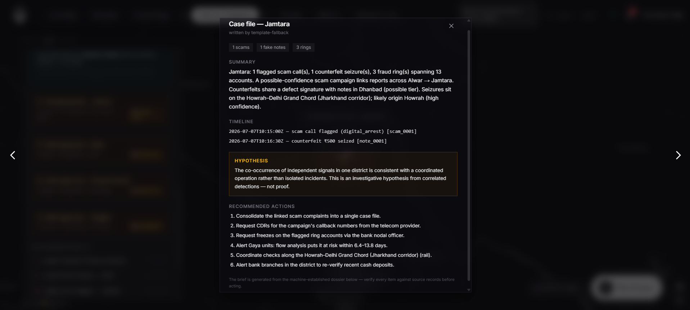
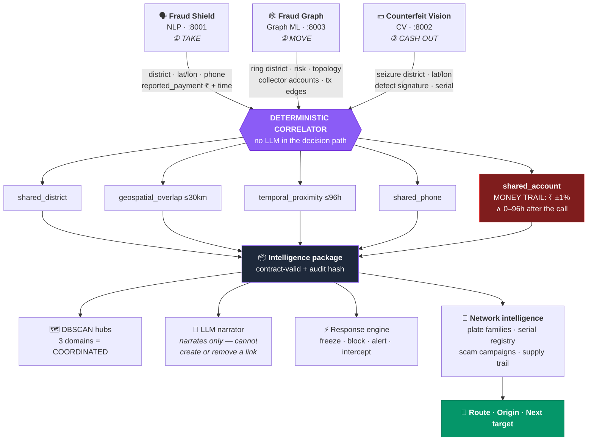
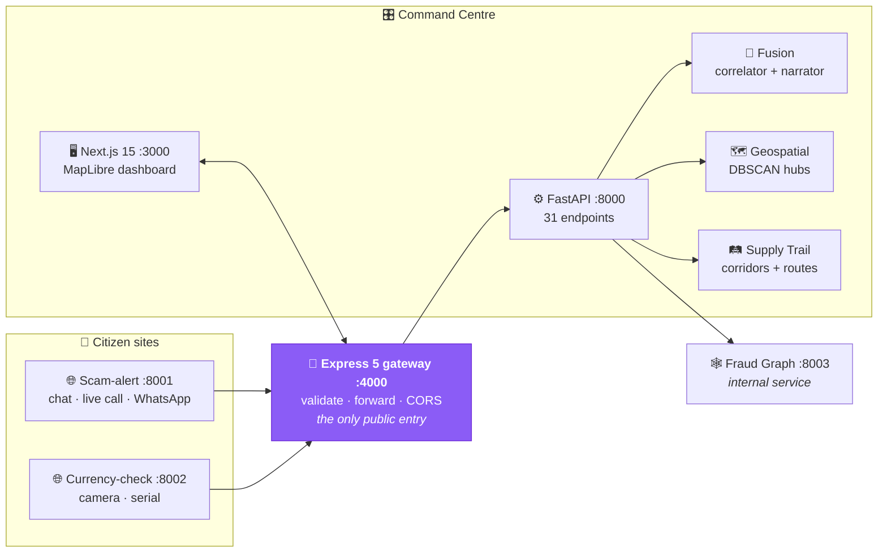

<div align="center">


# 🛡️ AEGIS AI

### Digital Public Safety Intelligence Platform

**Three AI systems. One correlated picture. Every verdict carries its evidence.**

<br>


*ET AI Hackathon 2026 · Problem Statement #6 — Defeating Counterfeiting, Fraud & Digital Arrest Scams*
Smart Cities · Public Safety · Digital Trust · Geospatial Law Enforcement

</div>

---

> **Our aim was to reduce the investigative burden carried by the police — and to push past detection into prediction: inferring the most probable route the criminal money and counterfeit notes travelled, and the most probable place the operation is run from, so an officer opens a case with a ranked, evidence-backed lead instead of a stack of unconnected complaints.**

---

## 📖 Contents

[The problem](#-the-problem) · [Our thesis](#-our-thesis-three-crimes-one-pipeline) · [What we built](#-what-we-built) · [See it](#-see-it) · [Wow moments](#-the-wow-moments) · [How the modules connect](#-how-the-modules-connect-the-core-idea) · [Innovations](#-what-is-genuinely-new-here) · [Measured results](#-measured-results) · [Architecture](#-architecture) · [Module internals](#-module-internals) · [The doctrine](#-the-doctrine-engine-decides-ai-explains) · [Quick start](#-quick-start) · [Repo layout](#-repository-layout) · [API](#-api-surface) · [Limitations](#-honest-limitations) · [Team](#-team)

---

## 🔥 The problem

> **1.14 million** cybercrime complaints in India in 2023 — **up 60%** year-on-year.
> **₹1,776 crore** stolen by "digital arrest" scams in just **9 months of 2024** (MHA).
> **2.47 million+** Layer-1 mule accounts flagged by I4C; **₹17,000+ crore** lost since 2023.
> **Record FICN seizures** (RBI 2025) — ₹500 fakes good enough to beat manual bank checks.

These are not opportunistic crimes. They are **industrialised operations** — fraud compounds, spoofed numbers, AI-generated voices, fake government portals, rented mule accounts, farmed SIMs.

**The gap is not evidence after the fact. It is intelligence before mass victimisation.**

Today a scam call is reported *after* the victim pays. A fake note is found *after* it circulates. A mule ring is unwound *months* later. And nothing connects the three — police see three unrelated cases where there is **one operation**.

---

## 🧭 Our thesis: three crimes, one pipeline

Scam calls, mule rings, and counterfeit cash are not three problems. They are **three stages of one criminal money pipeline**:

```
 ① TAKE                    ② MOVE                        ③ CASH OUT
 scam calls /           mule-account rings              the cash economy
 digital arrest   ──▶   collection · layering    ──▶    where counterfeit
 phishing               round-tripping                  notes circulate
```

This isn't a narrative device — it's documented, and [`docs/crime-pipeline.md`](docs/crime-pipeline.md) carries the citations:

- Scam proceeds land **immediately in mule accounts** (RBI's own definition). The state's countermeasure — **RBI MuleHunter.ai** and the May 2026 **I4C–RBIH MoU** — validates this architecture. *Our fraud-graph module is a working MuleHunter-class engine; our fusion layer goes one step further and joins the mule ring back to the scam that fed it.*
- Laundered money **exits into cash**, and the criminal cash layer is exactly where **FICN** circulates — itself a trafficking network (NIA runs a dedicated Terror Funding & Fake Currency Cell).
- The **same districts** host multiple crime types (Jamtara belt, Mewat belt) because the *enabling infrastructure* is shared — rented accounts, SIM farms, forged KYC, local agents. **Infrastructure clusters geographically, not crime type** — which is why two independent detections converging on one district is real evidence of an organised hub.

**Aegis is the layer that sees all three stages at once.**

---

## 🏗️ What we built

| Module | Port | AI type | What it does | Lead |
|---|---|---|---|---|
| 🗣️ **Fraud Shield** | `8001` | NLP + rules + playbooks + agentic verification | Scam / digital-arrest classifier with **evidence spans**, replayable **reasoning chains**, live-call **mid-call intercept**, WhatsApp, 23 languages | Sudarsan |
| 💵 **Counterfeit Vision** | `8002` | CNN + OpenCV forensics + serial registry + vision-LLM | Fake-note detection **naming the failed security feature**, printing-run detection via serial dedup | Adharshan |
| 🕸️ **Fraud Graph** | `8003` | Graph features + XGBoost + Louvain | Clusters accounts into **mule rings in seconds**, topology-labelled, real-data validated | Prayag |
| 🎛️ **Command Centre** | `8000`/`4000`/`3000` | Agentic Gen-AI fusion + DBSCAN + deterministic engines | Correlates everything into **court-auditable intelligence packages**, predicts routes, derives actions | Pushkar (+ Prayag) |

**Three surfaces:** two citizen websites (scam check, currency check) → an Express gateway → a police/analyst command centre.

---

## 📸 See it

<div align="center">

| The command centre |
|---|
|  |
| *Module health, live signal cards, the cross-domain crime map, and the TAKE → MOVE → CASH OUT pipeline strip.* |

| The fusion moment — the platform's defining feature |
|---|
|  |
| *CRITICAL threat written live over deterministic evidence — with **₹49,999 traced into collector account acc_02033**, 29 linked signals, and the correlation basis shown as chips.* |

| Detection → prediction: the AI Case Officer |
|---|
|  |
| *One click turns a district into a brief: summary, timeline, hedged hypothesis, **inferred corridor and likely origin**, **predicted next-at-risk district**, and a numbered action list.* |

</div>

<details>
<summary><b>More screenshots</b> — detection, interception, supply trail, disrupt queue, honesty panels</summary>

| | |
|---|---|
|  **Scam verdict** — markers as evidence |  **Fake ₹500** — feature named |
|  **Mid-call intercept** — before the transfer |  **WhatsApp** channel |
|  **Ring viewer** — the money flow |  **Caught in ~3s** — a judge-named gang |
|  **Supply Trail** — route & origin |  **Disrupt queue** — SLA + audit |
|  **Model Card** — measured, untuned |  **Research Lab** — honest negatives |
|  **Coordinated hub** on the map |  **Bank Partner** B2B surface |

</details>

---

## 🎯 The wow moments

**1 · Catch a scam call, live.** Read a digital-arrest script aloud → flagged at **99.9% risk**, with the exact manipulation markers *and the playbook stage each one satisfies*.

**2 · Intercept before the money moves.** The live-call monitor re-scores the **cumulative transcript** every utterance — risk climbs `12% → 46% → 94%` and fires a **full-screen + spoken intercept before the payment demand completes**.

**3 · Catch a note.** Hold a fake ₹500 to the camera → **FAKE**, with the *specific* missing security feature named.

**4 · Catch a gang that didn't exist ten seconds ago.** Judges **name a ring**; it's injected into the transaction stream and **caught in ~3 seconds** with zero retraining — proof the model learned laundering *behaviour*, not account numbers. A **fraud console** goes further: design any money movement; laundering is caught, a normal day comes back clean.

**5 · The fusion moment.** Press **RUN FUSION**:

> *"A scam call in Alwar is linked to a fraud ring active in the same district, with a traced money trail of **₹49,999 to account acc_02033**…"* — **threat: CRITICAL**

That is not a heat map. **That is an account number you can freeze tonight.**

**6 · Then it predicts.** The case file infers the **corridor** the notes travelled, the **likely origin** (*Howrah, high confidence*), and **which district is at risk next** (*Gaya, within 6.4–13.8 days*).

---

## 🔗 How the modules connect (the core idea)

Three independently-trained models that share **no code and no features**, joined only by evidence keys each publishes into a JSON contract:


```mermaid
flowchart TB
    FS["🗣️ <b>Fraud Shield</b><br/>NLP · :8001<br/><i>① TAKE</i>"]
    FG["🕸️ <b>Fraud Graph</b><br/>Graph ML · :8003<br/><i>② MOVE</i>"]
    CV["💵 <b>Counterfeit Vision</b><br/>CV · :8002<br/><i>③ CASH OUT</i>"]

    CORR{{"<b>DETERMINISTIC CORRELATOR</b><br/>no LLM in the decision path"}}

    FS -->|"district · lat/lon · phone<br/>reported_payment ₹ + time"| CORR
    FG -->|"ring district · risk · topology<br/>collector accounts · tx edges"| CORR
    CV -->|"seizure district · lat/lon<br/>defect signature · serial"| CORR

    CORR --> R1["shared_district"]
    CORR --> R2["geospatial_overlap ≤30km"]
    CORR --> R3["temporal_proximity ≤96h"]
    CORR --> R4["shared_phone"]
    CORR --> R5["<b>shared_account</b><br/>MONEY TRAIL: ₹ ±1%<br/>∧ 0–96h after the call"]

    R1 & R2 & R3 & R4 & R5 --> PKG["📦 <b>Intelligence package</b><br/>contract-valid + audit hash"]

    PKG --> HUB["🗺️ DBSCAN hubs<br/>3 domains = COORDINATED"]
    PKG --> LLM["🧠 LLM narrator<br/><i>narrates only — cannot<br/>create or remove a link</i>"]
    PKG --> ACT["⚡ Response engine<br/>freeze · block · alert · intercept"]

    PKG --> NET["🔬 <b>Network intelligence</b><br/>plate families · serial registry<br/>scam campaigns · supply trail"]
    NET --> PRED["🎯 <b>Route · Origin · Next target</b>"]

    style CORR fill:#8b5cf6,stroke:#6d28d9,color:#fff
    style PKG fill:#1e293b,stroke:#8b5cf6,color:#fff
    style PRED fill:#059669,stroke:#047857,color:#fff
    style R5 fill:#7f1d1d,stroke:#ef4444,color:#fff
```

**In one sentence:** a scam call gives us *a phone, a district and a victim's payment*; the graph gives us *the account that payment landed in*; a seizure gives us *a district, a defect signature and a serial*. The correlator joins them on space, time, phone and money — and the network-intelligence layers lift that join from "three events" to **"one operation, running along this corridor, printed on this press, using this script."**

> **Why they can be joined without being coupled:** the modules never import each other. Every link above is computed from published, schema-validated fields — so any model can be swapped without breaking a single connection.

---

## 💡 What is genuinely new here

### 1 · Cross-domain fusion with a deterministic evidence engine
**No product correlates scam + counterfeit + fraud-graph signals.** Ours is architecturally novel in *how* it uses Gen AI: links require concrete, checkable evidence; the LLM **narrates** them and **cannot create, remove, or reweigh a link**. `audit_trail.inputs_hash` makes every package reproducible — re-run with the same inputs, get the same hash. *This is the challenge's "agentic AI for multi-source intelligence fusion", built so hallucination is structurally impossible in the evidence path.*

### 2 · A deployed self-improving classifier
An LLM **red-teams Fraud Shield** — writing next year's scam scripts including families the model has **never seen** (investment fraud, job-task scams). Half augment training; half are held out as unseen future scams.
**Result: recall on held-out unseen variants 68.8% → 100%, zero human labels** (held-out AUC 0.997). Exists in the literature (Jan 2026 paper); in **zero deployed products**.

### 3 · Scam playbooks — a reasoning chain a court can replay
Markers say *which* tricks appear. Playbooks recognise they form a **script**: authority → fabricated case → isolation → coercion, *in that order*, because each stage sets up the next. Encoded as finite ontologies (not learned — no labelled reasoning chains exist; not generated — a hallucinated chain is fatal for admissibility). **Every stage cites the exact span that satisfied it.** Chain completeness and canonical order become classifier features, so *"4 markers forming a coherent script"* scores differently from *"4 unrelated markers"*.

### 4 · Agentic verification — checking the scammer's own claims
A flagged message's entities are extracted and checked with **real tools** under per-tool timeouts and a wall-clock budget: where a shortlink **actually** redirects (SSRF-hardened), whether a quoted **IFSC** exists (free public API), whether a **UPI PSP** is real, phone reputation. An LLM synthesises **only tool-confirmed findings** plus an in-prompt claim cross-check *("CBI does not arrest over WhatsApp")*. It returns a separate `verification` object and **never touches verdict, risk, or markers**.

### 5 · Counterfeit printing-run detection via a serial registry
Real counterfeiting is industrial: a press copies **one genuine serial onto every note of a plate**. Aegis validates the **RBI Mahatma Gandhi (New) Series** format (digit + 2 letters + 6 digits; I/O never used; repeated/sequential blocks = prop-money tells), then checks a **durable sighting registry** (MongoDB Atlas → JSON fallback, every path fails open). The same serial in two scans ⇒ `duplicate` ⇒ **evidence of a printing run** — a network signal no single-note scanner can produce.

### 6 · Plate families & campaign fingerprinting
**Plate families:** counterfeits from one source fail the *same* features — a plate that can't reproduce the security thread fails it on every note (the principle the US Secret Service uses to class counterfeits). Tiered `high` / `probable` / `possible`, each listing its evidence.
**Scam campaigns:** one gang runs one script — near-identical texts across districts are **one campaign**, clustered deterministically by token-Jaccard + shared callback numbers + distinctive-bigram guards.

### 7 · Supply Trail — multi-modal provenance inference
Seizures are snapped to **real documented corridors** (e.g. the Howrah–Delhi Grand Chord through the Jamtara–Dhanbad belt), clustered, walked outward from the densest cluster to infer the **injection zone and origin**, and corroborated against an **FIR corpus**. A multi-modal network (cities/ports/airports merged as physical nodes; intra-corridor, transfer and last-mile edges; weight = distance × mode-plausibility) yields the **k most plausible routes** via **Dijkstra + Yen**, deduplicated by mode-sequence. Deterministic, reproducible, with a confidence band and a **mandatory disclaimer** — an investigative lead, never a verdict.

### 8 · The cap-only AI safety invariant
Every advisory layer obeys one machine-enforced, test-covered rule:

> An auxiliary finding can make the system **more cautious** — cap a `genuine` verdict to `uncertain`, forcing manual review. It can **never convict and never acquit.**

A note is never certified genuine while any check fails; a `fake` verdict is never softened. Fraud Shield's **marker safety net** mirrors it: 3+ tripped markers can never render as clean. *This answers "false positives must be very low" with an architecture, not a threshold.*

### 9 · Mid-call intercept — pre-victimisation, not post-complaint
Cumulative-transcript re-scoring fires a full-screen + spoken intercept **before the payment ask completes**. Detection at the *point of contact*, not the point of complaint.

### 10 · The money trail — a victim's report → a freezable account
Amount (±1%) ∧ payment 0–96h after the call, matched against **real transaction edges into ring collector accounts**. District is *bonus corroboration, never a gate* — mule rings deliberately operate far from victims; that's the point of layering.

### 11 · Cross-domain coordinated hubs, honestly tiered
DBSCAN over all domains (25 km). **All three converging = `coordinated`**; exactly two = `multi_signal`, reported but never overclaimed. *Accuracy over drama, encoded in the tier logic itself.*

### 12 · Contract-first architecture
The **only coupling is JSON** — 6 versioned schemas, samples, and a validator run before every hand-off. Four people built four systems in parallel with near-zero merge conflicts. **183 tests** keep the contracts honest.

### 13 · Honest-negative research reporting
Three real experiments ship **with their negative results as prominent as the positives**, verdicts generated from the data. A red *"federation did NOT beat the best single bank on this run"* box next to a perfect 0.0 false-merge rate is worth more than a fabricated success — and it's the same evidentiary discipline the platform preaches.

---

## 📊 Measured results

> Every figure is read from the model's **own persisted train/eval report** — the same files the dashboard's **Model Card** (`GET /metrics`) serves live, with its printed disclaimer: *not recomputed, not tuned for display.*

### Fraud Shield — scam / digital-arrest
Template-grouped 3-way split (tune on val, report on untouched test) so paraphrases can't leak.

| Metric | Value |
|---|---|
| ROC-AUC | **0.994** |
| Average precision | 0.989 |
| Scam precision @ precision-first threshold | **0.980** |
| Scam recall | 0.943 |
| **Digital-arrest family recall** | **1.00** |
| False-alarm rate (1 − precision) | **2.0%** |
| Train / test | 3,407 / 1,076 |

**Self-improvement loop** — eval half never trained on; two families brand-new:

| | Before | After |
|---|---|---|
| Recall on held-out LLM-evolved variants (n=64) | 68.8% | **100%** |
| — investment fraud *(never seen)* | 75% | 100% |
| — job-task scam *(never seen)* | 37.5% | 100% |
| Held-out ROC-AUC | — | 0.997 |
| **Human labels used** | **0** | **0** |

### Counterfeit Vision
**Real photographed notes** (~4,900 genuine + ~2,500 **real counterfeits**, ₹10–₹2000, mobile-camera, varied lighting): accuracy **0.969** · ROC-AUC **0.994** · fake P/R **0.976 / 0.964** · false-alarm **2.4%**

**Synthetic baseline** (per-feature ground truth no public dataset has):

| Metric | Value |
|---|---|
| ROC-AUC | 0.962 |
| **Fake-verdict precision** | **1.00** — zero false accusations |
| Fake-verdict recall | 0.79 |
| Uncertain (→ manual check) | 18.3% |
| OpenCV feature checks | **40/40 genuine clean · 40/40 fakes caught with the correct feature named** |

### Fraud Graph
Synthetic world = 3 laundering topologies **plus legit heavy actors** (merchants, payroll, B2B) so "big amount" alone can't score.

| Metric | Value |
|---|---|
| ROC-AUC | **0.998** |
| Average precision | 0.971 |
| Precision / recall @ threshold | 0.90 / 0.973 |
| **Ring recovery** | **12/12 (100%)** |
| Account P/R within rings | **0.976 / 0.988** |
| Per-topology | chains, fan-ins **and** cycles all recovered |

**Real-data validation — Elliptic++**, two deliberate tiers:

| Claim | Run | Result |
|---|---|---|
| *Our pipeline transfers to real data* | Induced subgraph, **our own** structure-only features (14,266 illicit + 50k licit) | **AUC 0.945** |
| *The approach is benchmark-competitive* | Official 55 features on the full **823k-wallet** graph | **AUC 0.994** · AP 0.950 · P/R 0.900/0.854 |

It transfers because we score graph **topology** (fan-in/out, layering, community) — not currency-specific features. The same reason it applies to UPI rails.

**Detection latency:** a never-seen ring is caught **~3 s** after its transactions enter the stream. *We label this honestly: "lead time before mass victimisation" is a workflow claim, not a stored number — latency is what is measured.*

### Research lab

| Experiment | Result | Verdict shown |
|---|---|---|
| **Ghost Ring** (federated, GraphSAGE + DP + Hungarian matching) | matching precision **1.00**, **false-merge 0.00**; fused recall 0.494 vs best bank 0.73 | 🔴 *Honest negative — privacy-preserving matching validated; recall gain not demonstrated* |
| **Arms Race** (DEAP co-evolution, + PPO variant) | gen 30: best-escape **0.86**, detector recall **0.20** | 🟠 *Attacker wins — which is why the self-improving loop exists in the product* |
| **Spectral** (Laplacian Rayleigh quotient + BWGNN + sonification) | ring **0.917** vs matched clean **0.693** — shift **+0.223** | 🟢 *Validated on matched pairs; cross-community ranking labelled a triage hint only* |

---

## 🏛️ Architecture


```mermaid
flowchart LR
    subgraph citizens["👥 Citizen sites"]
        W1["🌐 Scam-alert :8001<br/>chat · live call · WhatsApp"]
        W2["🌐 Currency-check :8002<br/>camera · serial"]
    end
    GW["🚪 <b>Express 5 gateway :4000</b><br/>validate · forward · CORS<br/><i>the only public entry</i>"]
    subgraph cc["🎛️ Command Centre"]
        BE["⚙️ FastAPI :8000<br/>31 endpoints"]
        FU["🧠 Fusion<br/>correlator + narrator"]
        GEO["🗺️ Geospatial<br/>DBSCAN hubs"]
        ST["🛤️ Supply Trail<br/>corridors + routes"]
        FE["🖥️ Next.js 15 :3000<br/>MapLibre dashboard"]
    end
    FG["🕸️ Fraud Graph :8003<br/><i>internal service</i>"]

    W1 & W2 --> GW --> BE
    BE --> FG & FU & GEO & ST
    FE <--> GW

    style GW fill:#8b5cf6,stroke:#6d28d9,color:#fff
```

**Design rules that made this work:**
- **Contracts are the only coupling** — 6 schemas in [`contracts/`](contracts/), validated at every hand-off *and* again at the backend ingest door.
- **The gateway is the single public entry** — internal ML services are never exposed; origin-allowlisted CORS, 5 MB body cap, API-key pass-through.
- **Keyless free map tiles** (CARTO / Esri via MapLibre) — the demo cannot die on a missing token.
- **Everything degrades gracefully** — per-module health, LLM failover, fail-open database paths.

📐 Full diagrams: [`docs/architecture.md`](docs/architecture.md)

---

## 🔬 Module internals

<details open>
<summary><b>🗣️ Fraud Shield — NLP scam & digital-arrest detection</b></summary>

- **Marker engine** — 8 contract-locked markers written for the Indian landscape (CBI/ED/TRAI impersonation, fake FIR, digital-arrest video-call isolation, KYC-freeze pressure, UPI/gift-card/USDT demands, secrecy, spoofed identity), each returning **exact evidence spans**.
- **Playbooks** — `digital_arrest`, `kyc_fraud`, `advance_fee` as finite ontologies; stage matches cite spans; completeness + canonical order feed the classifier.
- **Classifier** — word n-grams (*what is said*) ⊕ char n-grams (*obfuscation like `K.Y.C`, `b1t.ly`*) ⊕ marker ⊕ playbook features → Logistic Regression. Baseline-first by plan: trains in seconds, fully inspectable, within a few points of DistilBERT on short-message tasks. Precision-first thresholds from the held-out PR curve.
- **Corpus** — UCI SMS Spam (5,574 real SMS) + a **seeded, deterministic** synthetic Indian-scam corpus (same seed → same rows → reproducible metrics) with **hard legit negatives** (genuine bank OTPs, real police-verification calls, courier updates) so the model can't key on the word "police".
- **Live call** — Mode B scripted replay, Mode A browser mic (Chrome/Edge SpeechRecognition, en-IN); cumulative re-scoring; intercept overlay + `speechSynthesis` warning.
- **WhatsApp** — Twilio webhook with **HMAC-SHA1 `X-Twilio-Signature` validation** (tunnel-aware) → TwiML reply; plus a phone-frame simulator needing zero external deps.
- **23 languages** — English + all 22 scheduled Indian languages via Sarvam AI (translate in → classify in English → advisory back). A wrapper, not a retrain; fails safe to English and honestly reports `translated: false`.
- **50 tests**, contract-validated.

</details>

<details open>
<summary><b>💵 Counterfeit Vision — fake-currency detection</b></summary>

A **layered funnel — cheap-and-certain before expensive-and-probabilistic:**

1. **Triage (OpenCV, pre-AI)** — quality gate (resolution / blur / exposure → `unscannable` with rescan advice, because the CNN would only produce noise) and hard tells: B&W photocopy saturation *(conclusive)*, flat-print texture, aspect-ratio window, ink-hue windows. `obvious_fake` needs **≥2 independent tells or one conclusive**. A "pass" claims nothing — **the CNN verdict is never overridden**.
2. **CNN** — EfficientNet-B0, head-only fine-tuning (the textbook small-data recipe), trained on **real photographed genuine + counterfeit notes**. An `uncertain` band routes to manual check — *a note is money, and the false-positive requirement cuts both ways.*
3. **Feature checks** — security-thread column-darkness at the true thread position, watermark brightness lift, microprint Laplacian sharpness — each pass/fail **with a numeric score** → `missing_features`. Fusion: ≥2 failed (or 1 + elevated CNN) ⇒ fake; **never genuine while any check fails**.
4. **Serial layer** — RBI format validation + durable sighting registry (printing-run detection).
5. **Vision-LLM** — three narrow questions optics can't answer: portrait is Gandhi? SPECIMEN overprint? header reads "RESERVE BANK OF INDIA"? Claude → Gemini → absent. **Cap-only.** SPECIMEN is deliberately *not* counterfeit — genuine RBI specimen notes exist; it means "not legal tender → manual check".

Plus contour + perspective-warp **note localisation** so angled phone shots land the feature regions. **28 tests.**

</details>

<details open>
<summary><b>🕸️ Fraud Graph — ring detection</b></summary>

- **Synthetic world** — mule chains (decaying per-hop amounts), smurfing fan-in collectors, round-tripping cycles, **plus legitimate heavy actors**. Chosen deliberately: real fraud datasets are anonymised (no districts, unreadable IDs) and can't demo live; synthetic rings carry **known ground truth** and light up named districts — while the loader swaps in Elliptic++ with one flag.
- **18 graph features** — fan-in/out ratios, burst ratio, throughput, hold time, PageRank, clustering coefficient, core number, mule score… → **XGBoost** with **persisted feature importances** (auditability is a judged criterion). *The model never sees raw transactions — it sees graph-shaped behaviour, which is what lets it follow the money like an investigator.*
- **Rings** — high-risk subgraph → Louvain communities (+ connected-component sweep) → named rings scored by mean member probability, each with a **topology label an investigator reads at a glance**.
- **Live surfaces** — inject-ring (judge-named gangs, ~3 s), fraud console (arbitrary human-designed transactions), reset; **ring viewer** draws the real money flow with plain-word evidence.
- **Research** — Ghost Ring (GraphSAGE + differential privacy + Hungarian matching + Leiden), Arms Race (DEAP, optional PPO), Spectral (eigendecomposition, BWGNN wavelets, sonification).
- **44 tests** including end-to-end contract compliance.

</details>

<details open>
<summary><b>🎛️ Command Centre — fusion, geospatial, intelligence, action</b></summary>

- **Dashboard (22 components)** — health pills, signal cards, click-to-fly alerts, pipeline strip with fusion-lit arrows, full-bleed MapLibre map with pulsing markers and coordinated-hub rings, **RUN FUSION** typewriter reveal with on-screen audit hash, FusionChatBot, ring viewer, case-file modal, Disrupt / Bank Partner / Supply Trail / Model Card / Research Lab tabs.
- **AI Case Officer** — `build_dossier()` gathers **deterministic evidence** (scams, rings, seizures, plate families, campaigns, supply trail, temporal flow — every item real module output); an LLM writes summary, timeline, a **hedged** hypothesis and actions, **each citing dossier evidence ids**; references outside the dossier are forbidden; template writer guarantees a brief with zero keys.
- **Response engine** — deterministic rules → recipient-addressed actions with priority, **SLA against the fraud clock** (critical 30 min · high 2 h · medium 24 h — *a UPI transfer clears in seconds, so a freeze must beat cash-out*), `trigger.refs` evidence chains, append-only audit. **Dispatch is simulated and labelled**; the engine never asserts guilt.
- **B2B** — `screen-account` (≥0.7 → BLOCK + file STR, ≥0.4 → EDD, else monitor/clear) and terse `verify-note` for POS, behind `X-API-Key`.
- **Durable briefing cache** — the last real model-written briefing lives in MongoDB so an outage degrades to *"the previous analysis"*, not template prose. Every Mongo path fails open.
- **15 + 9 + 8 + 29 tests** across backend, fusion, geospatial, supply-trail.

</details>

---

## ⚖️ The doctrine: *engine decides, AI explains*

Every verdict, link, threat level, route and action comes from a **deterministic engine**. LLMs only narrate. Where a model *does* see something directly (vision review, case officer), its output is **capped, hedged and citation-bound**.

| Layer | Evidence artefact it ships |
|---|---|
| Scam verdict | Marker **evidence spans**, **playbook chain** with per-stage citations, tool-verified claims, model probability |
| Counterfeit | Per-feature scores, triage tells with measurements, serial status + prior sightings, capture ref |
| Ring | **Feature importances**, plain-word account evidence, member/edge lists, topology label |
| Intel layers | Match **tiers with explicit rules** + listed evidence; routes with per-claim traceability + mandatory disclaimer |
| Fusion | `correlation_basis` per link (with measured distance/hours), threat derivation, **reproducible `inputs_hash`** |
| Action | `trigger.refs` chain, priority/SLA, **append-only audit log** |
| Model claims | Model Card reads persisted reports **with a printed disclaimer**; postures labelled *Predictive / Point-of-contact / Fast-classification* |

**Failover chain everywhere:** `Claude → Groq (Llama-3.3-70B) → Gemini → deterministic template`, with a Mongo briefing cache as an intermediate floor. **The entire platform runs with zero API keys** — the demo cannot die on stage, and a district deployment cannot die on budget.

**Security & privacy:** precision-first thresholds · cap-only invariants · legit verdicts excluded from correlation · **(ε,δ)-differential privacy** on federated embeddings · hashed tokens · gitignored `.env` · Twilio HMAC validation · SSRF-hardened tools · API-key gated B2B · ingest schema validation · origin-allowlisted CORS · bounded event store.

---

## 🚀 Quick start

```powershell
./setup.ps1        # first time — venvs, deps, model training, npm install
./run-all.ps1      # every run — all 6 services
./run-all.ps1 -Stop
```

Then open **http://localhost:3000**. Citizen sites: **:8001** (scam) and **:8002** (currency).

<details>
<summary><b>Per-service commands</b></summary>

```bash
# 1 · Fraud Shield (NLP)                                     → :8001
cd fraud-shield-nlp && pip install -e ".[dev]"
python -m aegis_fraud_shield.cli train
uvicorn aegis_fraud_shield.api:app --app-dir src --port 8001

# 2 · Counterfeit Vision (CV)                                → :8002
cd counterfeit-vision && pip install -e ".[dev]"
python -m aegis_counterfeit.cli prepare-real   # or: generate (synthetic)
python -m aegis_counterfeit.cli train
uvicorn aegis_counterfeit.api:app --app-dir src --port 8002

# 3 · Fraud Graph (Graph ML)                                 → :8003
cd fraud-graph-ml && uv pip install -e ".[dev]"
fraud-graph demo          # train + detect + contract-validate
fraud-graph serve

# 4 · Command-centre backend                                 → :8000
cd command-centre/backend && uv pip install -e . -e ../fusion -e ../geospatial -e ../supply_trail
uvicorn aegis_command.api:app --app-dir src --port 8000

# 5 · Gateway                                                → :4000
cd command-centre/gateway && npm install && npm start

# 6 · Dashboard                                              → :3000
cd command-centre/frontend && npm install && npm run dev
```

</details>

**Optional Gen AI** — drop a free key in `command-centre/fusion/.env`; without one, deterministic templates keep **every** feature alive:
```
GROQ_API_KEY=gsk_...        # free & fast — console.groq.com
GEMINI_API_KEY=...          # optional
ANTHROPIC_API_KEY=...       # optional
SARVAM_API_KEY=...          # optional — 22-language translation
MONGODB_URI=...             # optional — durable serial registry + briefing cache
```

---

## 📁 Repository layout

```
Aegis/
├── contracts/              📜 6 JSON schemas + samples — the only coupling between modules
├── fraud-shield-nlp/       🗣️ markers · playbooks · verify agent · classifier · citizen UIs   :8001
├── counterfeit-vision/     💵 triage · CNN · feature checks · serials · vision agent · camera :8002
├── fraud-graph-ml/         🕸️ 18 features · XGBoost · rings · ghost-ring/arms-race/spectral    :8003
├── command-centre/
│   ├── backend/            ⚙️ FastAPI — fusion · actions · intel · B2B · case officer         :8000
│   ├── fusion/             🧠 correlator + multi-provider narrator + self-improving classifier
│   ├── geospatial/         🗺️ DBSCAN hotspots — cross-domain hubs
│   ├── supply_trail/       🛤️ corridor engine · multi-modal routes · FIR corroboration
│   ├── gateway/            🚪 Express 5 public entry point                                     :4000
│   └── frontend/           🖥️ Next.js 15 + MapLibre dashboard (22 components)                  :3000
├── shared/                 🔧 contract validator — run before every hand-off
├── docs/                   📐 architecture · demo script · pitch deck · crime-pipeline ·
│                              deployment · submission document · screenshots
└── PROJECT_PLAN.md         📋 living plan + dated progress log
```

---

## 🔌 API surface

<details>
<summary><b>31 backend endpoints</b></summary>

| Group | Endpoints |
|---|---|
| Health & events | `GET /health` · `GET /events` |
| Ingest & analyze | `POST /ingest/scam` · `/ingest/counterfeit` · `/analyze/scam` · `/analyze/counterfeit` · `/refresh/fraud-graph` |
| Citizen | `GET /citizen/languages` · `POST /citizen/analyze` · `/citizen/call/analyze` · `/citizen/whatsapp` |
| Fusion | `POST /fuse` · `GET /fusion/latest` |
| Disrupt / Respond | `GET /actions` · `POST /actions/derive` · `/actions/{id}/dispatch\|acknowledge\|dismiss` |
| Institution (B2B) | `POST /institution/screen-account` · `/institution/verify-note` |
| Intelligence | `GET /intel/plate-families` · `/intel/campaigns` · `POST /case-file` · `GET /supply-trail` · `/supply-trail/routes` · `/hotspots` |
| Demo & research | `POST /demo/inject-ring` · `/demo/score-custom` · `/demo/reset` · `GET /rings/{id}/spectral` · `/research` · `/metrics` · `/dashboard-summaries` |

Plus module APIs: Fraud Shield `/analyze`, `/webhook/whatsapp`, `/live-call`, `/whatsapp` · Counterfeit `/analyze`, `/analyze_b64`, `/captures` · Fraud Graph `/fraud-graph`, `/detect`, `/demo/*`.

</details>

**Contract validation before every hand-off:**
```bash
python shared/validate_contract.py scam|counterfeit|graph|fusion <file.json>
```

---

## ⚠️ Honest limitations

*We state these before a judge asks — the platform's credibility **is** its evidentiary discipline.*

- **Transaction stream is synthetic / Elliptic++** — no live bank feed. That's a partnership, not a tech gap. Production would join by UPI/transaction reference, not amount (same join, stronger key).
- **Dispatch is simulated** — actions are queued, audited and **labelled simulated**; live telecom/bank/MHA wiring sits behind the already-built response contract.
- **Rings → counterfeit is geographic convergence**, not a traced artefact — tracing physical cash needs serial capture at seizure (the registry is step one).
- **Supply-trail provenance is a weighted hypothesis** — corridor-based, FIR-corroborated, disclaimer-carrying. An investigative lead, never proof.
- **Live-call audio** is browser STT today; a server STT front-end (Sarvam *saarika*), IVR transport, and validation on real recordings are next. Voice-spoofing detection is roadmap.
- **Research results are runs, not theorems** — federated recall gain unproven; arms race shows detector decay (*that's the point*); spectral ranking is a triage hint.
- WhatsApp runs in **Twilio sandbox**; production needs a WhatsApp Business account.

---

## ☁️ Deployment

Free-tier, fully env-driven: **Vercel** (dashboard) + **Render** (gateway, backend, ML services — models train on deploy since weights are gitignored) + **MongoDB Atlas M0** (durable serial registry & briefing cache, with fail-open file fallbacks). **Total infra cost: ₹0.** Full guide: [`docs/deployment.md`](docs/deployment.md).

---

## 📚 Documentation

| Doc | What's in it |
|---|---|
| [`docs/submission.md`](docs/submission.md) | **Full submission document** — the complete technical write-up |
| [`docs/architecture.md`](docs/architecture.md) | System, fusion-sequence and Detect→Disrupt→Respond diagrams |
| [`docs/crime-pipeline.md`](docs/crime-pipeline.md) | The researched thesis with public-record citations |
| [`docs/demo-script.md`](docs/demo-script.md) | 6-minute run-of-show with fallbacks + Q&A ammunition |
| [`docs/pitch-deck.md`](docs/pitch-deck.md) | Slide-by-slide, every number from a persisted report |
| [`docs/deployment.md`](docs/deployment.md) | Local, cloud and Docker paths |
| [`PROJECT_PLAN.md`](PROJECT_PLAN.md) | Living plan + dated progress log |

---

## 👥 Team

| | Owner | Module |
|---|---|---|
| 🗣️ | **Sudarsan** | Fraud Shield — classifier, markers, playbooks, corpus, chat UI, live-call monitor, WhatsApp |
| 💵 | **Adharshan** | Counterfeit Vision — CNN, real-dataset training, camera UI |
| 🕸️ | **Prayag** | Fraud Graph + Gen AI fusion — rings, Elliptic++, research lab, correlator, narrator, self-improve loop |
| 🎛️ | **Pushkar** | Command Centre — dashboard, gateway, map, 3-website architecture |

---

## 📦 Deliverables

- ✅ **Working prototype** — 6 services, 3 websites, 31 endpoints, 183 tests, all paths verified end-to-end
- ✅ **Architecture diagram** — [`docs/architecture.md`](docs/architecture.md)
- ✅ **Presentation deck** — [`docs/pitch-deck.md`](docs/pitch-deck.md)
- 🎬 **Demo video** — https://drive.google.com/file/d/1bdxVDEU7Ds6m1O_2noiKMBVDmUXSr9F1/view

---

<div align="center">

### Detect → Disrupt → Respond
**for law enforcement, financial institutions, and citizens**

*Every verdict carrying its evidence. Every action carrying its audit.*
**From point-of-complaint to point-of-contact.**

<br>

*Four people. A few days. Free-tier infrastructure.*
**Because the architecture — not the budget — is the innovation.**

<br>

## We're Aegis. 🛡️

</div>
