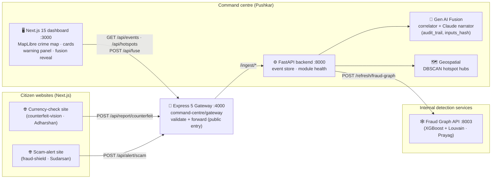

# 🏗️ Aegis — System Architecture

> Owned by the command-centre lead (Pushkar). Reflects the **3-website setup** decided 2026-07-07.

## The 3-website setup

| # | Site | Audience | Owner | Emits |
|---|---|---|---|---|
| 1 | **Currency-check website** — upload/scan a note, get genuine/fake verdict | Citizens | Adharshan (counterfeit-vision) | `counterfeit` JSON → gateway |
| 2 | **Scam-alert website** — paste/read a message or call transcript, get scam verdict + public alerts | Citizens | Sudarsan (fraud-shield-nlp) | `scam_detection` JSON → gateway |
| 3 | **Command-centre dashboard** — police/analyst view: cards + crime map + fusion | Law enforcement | Pushkar | consumes everything |

**Fraud Graph gets no separate website** — it is not citizen-facing. It runs as an internal
service (`:8003`) and its rings render inside the dashboard (left panel + map districts).

## Data flow

- **Contracts** (`contracts/*.schema.json`) are the only coupling between modules — every
  arrow above carries JSON validated against them.
- The **fusion layer stays in Python** (it imports directly into the FastAPI backend); the
  Express gateway is the public entry point so internal services are never exposed.
- **Map tiles are keyless & free** (CARTO dark / Esri imagery via MapLibre GL) — the demo
  cannot die on a missing API token.

## Ports

| Service | Port |
|---|---|
| Fraud Shield API (Sudarsan) | 8001 |
| Counterfeit Vision API (Adharshan) | 8002 |
| Fraud Graph API (Prayag) | 8003 |
| Command backend (FastAPI) | 8000 |
| Express gateway | 4000 |
| Dashboard (Next.js) | 3000 |
