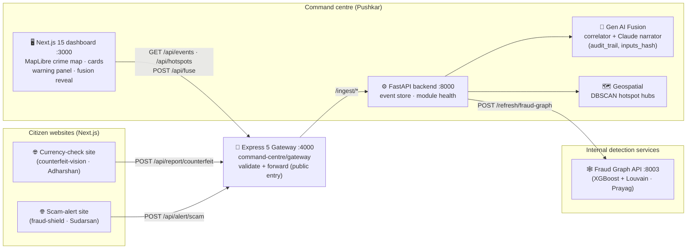
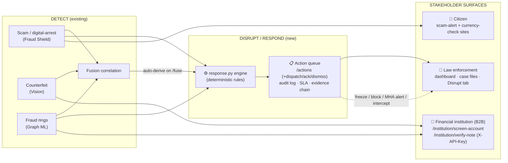
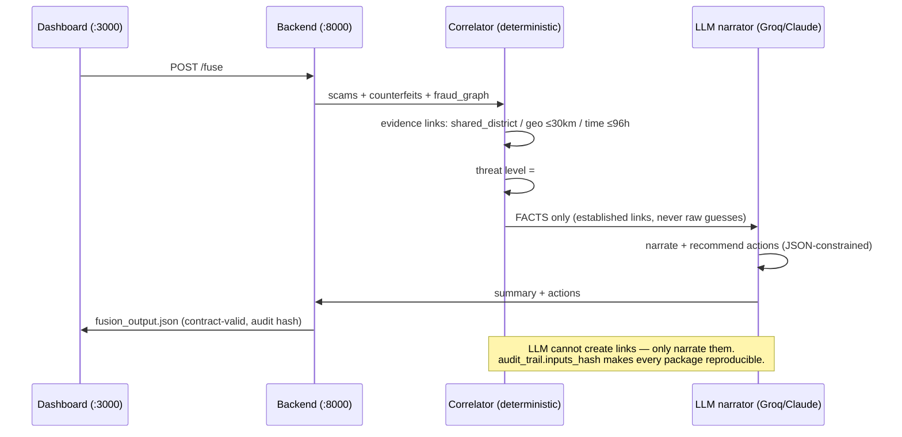

# 🏗️ Aegis — System Architecture

> Owned by the command-centre lead (Pushkar). Reflects the **3-website setup** decided 2026-07-07.

## The 3-website setup

| # | Site | Audience | Owner | Emits |
|---|---|---|---|---|
| 1 | **Currency-check website** — upload/scan a note, get genuine/fake verdict | Citizens | Adharshan (counterfeit-vision) | `counterfeit` JSON → gateway |
| 2 | **Scam-alert website** — paste/read a message or call transcript, get scam verdict + public alerts | Citizens | Sudarsan (fraud-shield-nlp) | `scam_detection` JSON → gateway |
| 3 | **Command-centre dashboard** — police/analyst view: cards + crime map + fusion | Law enforcement | Pushkar | consumes everything |

**Fraud Graph gets no separate website** — it is not citizen-facing. It runs as an internal
service (`:8003`) and its rings render inside the dashboard (left panel + map districts).

## Data flow

- **Contracts** (`contracts/*.schema.json`) are the only coupling between modules — every
  arrow above carries JSON validated against them.
- The **fusion layer stays in Python** (it imports directly into the FastAPI backend); the
  Express gateway is the public entry point so internal services are never exposed.
- **Map tiles are keyless & free** (CARTO dark / Esri imagery via MapLibre GL) — the demo
  cannot die on a missing API token.

## Detect → Disrupt → Respond (three stakeholders)

The challenge names three stakeholders (law enforcement, **financial institutions**, citizens)
and three verbs (**detect, disrupt, respond**). Detection feeds a deterministic **response-action
engine** that turns a finding into a concrete, recipient-addressed, auditable action; a separate
**API-key-gated B2B surface** serves banks. Dispatch is *simulated* (no live government/bank wire)
and every action says so.

**New endpoints (command-centre backend):**

| Endpoint | Purpose |
|---|---|
| `POST /fuse` | now also auto-derives response actions |
| `GET /actions` · `POST /actions/derive` | the disrupt/respond queue |
| `POST /actions/{id}/dispatch\|acknowledge\|dismiss` | act on one action (simulated dispatch, audited) |
| `POST /institution/screen-account` | AML risk for one account (X-API-Key) |
| `POST /institution/verify-note` | teller/POS note check (X-API-Key) |
| `GET /metrics` | Model Card — measured P/R, FPR, AUC, per-family, lead time |

- **Additive contract:** `contracts/response_action.schema.json` — an action never asserts guilt;
  it carries `trigger.refs` (evidence chain) + an append-only `audit` log for admissibility.
- **Honest posture:** each model is labelled Predictive (Fraud Shield, pre-transfer) /
  Point-of-contact (Counterfeit) / Fast-classification (Graph) — no overclaiming "predictive".

## Ports

| Service | Port |
|---|---|
| Fraud Shield API (Sudarsan) | 8001 |
| Counterfeit Vision API (Adharshan) | 8002 |
| Fraud Graph API (Prayag) | 8003 |
| Command backend (FastAPI) | 8000 |
| Express gateway | 4000 |
| Dashboard (Next.js) | 3000 |

---

## Appendix — detection & fusion internals

> Deeper diagrams from the fusion/detection side (Prayag). The 3-website flow above is the
> deployment topology; this appendix is what happens *inside* the boxes.

## The fusion pipeline (innovation #1)

## Why this architecture wins the judged criteria

| Criterion | Architectural answer |
|---|---|
| **Innovation** | Fusion of 3 independent detectors; deterministic-evidence + LLM-narration split; cross-domain DBSCAN hubs; LLM red-team self-improvement loop |
| **Auditability / legal admissibility** | Marker evidence spans (NLP), per-feature check scores (CV), feature importances (graph), correlation basis + reproducible `inputs_hash` (fusion) |
| **Low false positives** | Every module thresholds precision-first from its PR curve; `legit`/`genuine` verdicts are excluded from correlation entirely |
| **Scalability** | Modules are independent services speaking versioned JSON contracts — swap any model without touching the rest |
| **Resilience (demo!)** | LLM failover chain ends in a deterministic template; dashboard degrades gracefully per-module |

## Port map

| Service | Port | Owner |
|---|---|---|
| Fraud Shield API + chat UI | 8001 | Sudarsan |
| Counterfeit Vision API + camera UI | 8002 | Adharshan |
| Fraud Graph API | 8003 | Prayag |
| Command-centre backend | 8000 | Pushkar/Prayag |
| Dashboard (Next.js) | 3000 | Pushkar/Prayag |
