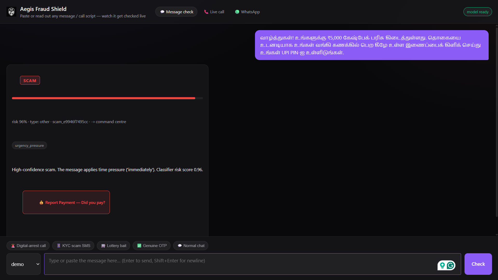
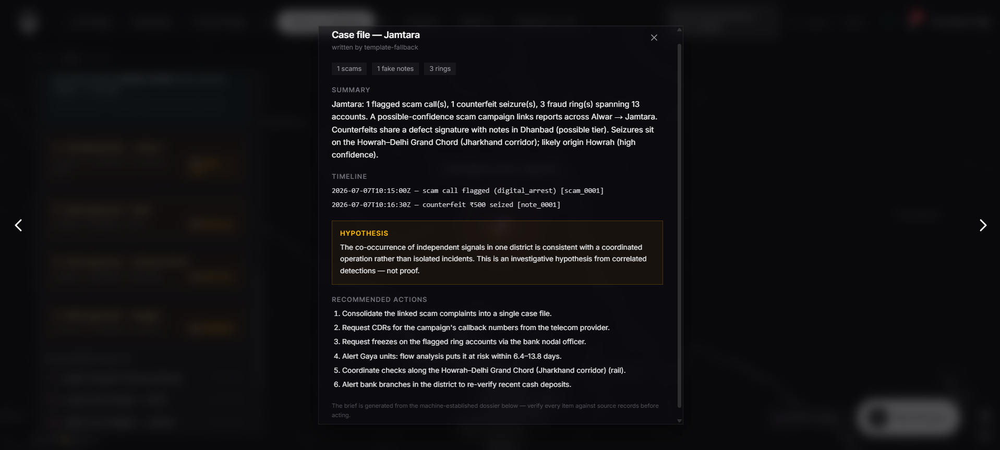

<div align="center">

<br><br><br>

# 🛡️ AEGIS AI

## Digital Public Safety Intelligence Platform

<br>

### Hackathon Submission Document

<br>

**ET AI Hackathon 2026 — Problem Statement #6**
*AI for Digital Public Safety: Defeating Counterfeiting, Fraud & Digital Arrest Scams*

**Theme:** Smart Cities · Public Safety · Digital Trust · Geospatial Law Enforcement

<br><br>

> **Three AI systems. One correlated picture. Every verdict carries its evidence.**

<br><br>

| | |
|---|---|
| **Team** | Aegis |
| **Members** | Sudarsan (Fraud Shield — NLP) · Adharshan (Counterfeit Vision — CV) · Prayag (Fraud Graph — Graph ML + Gen AI Fusion) · Pushkar (Command Centre) |
| **Repository** | github.com/sudarsan2507-hue/Aegis |
| **Date** | July 2026 |

<br><br><br>

</div>

---

## Executive Summary

India logged **1.14 million cybercrime complaints in 2023** (up 60% year-on-year). "Digital arrest" scams alone stole **₹1,776 crore in the first nine months of 2024**. The RBI's 2025 Annual Report flagged record seizures of fake ₹500 notes good enough to beat manual bank checks. Yet every one of these crimes is investigated **in isolation, after the complaint** — a scam call in one file, a fake note in another, a mule account in a third.

**Aegis is the intelligence layer that sees them together, before mass victimisation.**

> **Our aim was to reduce the investigative burden carried by the police — and to push past detection into prediction: inferring the most probable route the criminal money and counterfeit notes travelled, and the most probable place the operation is run from, so an officer opens a case with a ranked, evidence-backed lead instead of a stack of unconnected complaints.**

That aim is visible in the product, not just the pitch. A district case file does not stop at "three crimes happened here" — it reads: *"Seizures sit on the Howrah–Delhi Grand Chord (Jharkhand corridor); likely origin Howrah (high confidence)"*, and it tells the officer where to look **next**: *"Alert Gaya units — flow analysis puts it at risk within 6.4–13.8 days."* One click turns scattered signals into a route, an origin, a predicted next target, and a numbered action list.

We built a working, end-to-end **Digital Public Safety Intelligence Platform** with four cooperating systems:

1. **Fraud Shield** — a real-time scam / digital-arrest classifier (NLP) that flags a scam **mid-message and mid-call, before any money moves**; names the exact manipulation markers *and the scam script they form* (an encoded reasoning chain a court can replay); **verifies the scammer's own claims with live tools** (where a short-link really redirects, whether a quoted IFSC exists); answers in **English + all 22 scheduled Indian languages**; and reaches citizens over the **web, live-call monitoring, and WhatsApp**.
2. **Counterfeit Vision** — a camera-based fake-note detector trained on **real photographed counterfeits across ₹10–₹2000**, naming the **specific missing security feature**; backed by a pre-AI forensic triage layer, an **RBI serial-number validator with a durable duplicate-sighting registry** (catches counterfeit *printing runs*), and a vision-LLM review — none of which can ever certify a note genuine, only make the system more cautious.
3. **Fraud Graph** — a graph-ML engine (18 topology features + XGBoost + Louvain communities) that clusters accounts into **mule rings in seconds**, labels each ring's laundering topology (chain / fan-in / cycle), recovered **12/12 planted rings**, and is **real-data validated on the Elliptic++ Bitcoin fraud benchmark at two tiers** (pipeline-transfer run and official-features benchmark run).
4. **Command Centre** — a police/analyst dashboard with a cross-domain crime map, a **deterministic evidence correlator narrated (never decided) by Gen AI**, DBSCAN coordinated-hub detection, **counterfeit plate-family forensics**, **scam campaign fingerprinting**, a **multi-modal Supply Trail provenance engine**, an **AI Case Officer** that writes district case briefs from auditable dossiers, a Disrupt/Respond **action queue with SLAs and append-only audit logs**, API-key-gated **B2B endpoints for banks**, and a live **Model Card** that reads every metric from the models' own persisted reports.

The platform's thesis — backed by public I4C/RBI records — is that scam calls, mule rings, and counterfeit cash are **three stages of one criminal money pipeline** (TAKE → MOVE → CASH OUT). Aegis is, to our knowledge, the first system to detect all three stages and **join them with deterministic, court-auditable evidence**: shared district, ≤30 km, ≤96 h, shared phone, and an exact money-trail match from a victim's reported payment into a detected ring's collector account.

**By the numbers:** 4 AI modules · 6 services · 3 websites · **31 backend API endpoints** · **6 versioned JSON contracts** · **183 automated tests** · 23 languages · 3 research experiments with honest verdicts · **₹0 infrastructure cost**.

Headline measured results (all from persisted, reproducible reports — nothing tuned for display):

- Scam classifier: **ROC-AUC 0.994**, scam-verdict **precision 0.98**, digital-arrest recall **100%**
- Self-improving loop: recall on **unseen, never-trained scam families 69% → 100%** with zero human labels
- Counterfeit: fake-note **precision 1.00** (synthetic baseline); **0.97/0.96 P/R** on real photographed counterfeits
- Fraud rings: **12/12 rings recovered**, account precision **0.976** / recall **0.988**; **0.994 AUC on real data**
- Live demo latency: a never-before-seen ring injected by judges is **caught in ~3 seconds**

---

## Table of Contents

1. [Problem Statement & Motivation](#1-problem-statement--motivation)
2. [Proposed Solution](#2-proposed-solution)
3. [What We Did That Is New, Different, and First-Time](#3-what-we-did-that-is-new-different-and-first-time)
4. [Comparison With Existing Solutions](#4-comparison-with-existing-solutions)
5. [Metrics & Measured Results](#5-metrics--measured-results)
6. [System Architecture](#6-system-architecture)
7. [Module Deep-Dives](#7-module-deep-dives)
8. [Generative AI: Doctrine, Fusion & Resilience](#8-generative-ai-doctrine-fusion--resilience)
9. [Research Lab — Advanced Experiments, Honestly Reported](#9-research-lab--advanced-experiments-honestly-reported)
10. [Auditability, Legal Admissibility & Safety](#10-auditability-legal-admissibility--safety)
11. [Scalability & Deployment](#11-scalability--deployment)
12. [User Experience](#12-user-experience)
13. [Challenge Compliance Matrix](#13-challenge-compliance-matrix)
14. [Honest Limitations & Roadmap](#14-honest-limitations--roadmap)
15. [The Platform in Action — Screenshots](#15-the-platform-in-action--screenshots)
16. [Results & Conclusion](#16-results--conclusion)
17. [Appendix: Team, Repository & How to Run](#17-appendix-team-repository--how-to-run)

---

## 1. Problem Statement & Motivation

### 1.1 The scale of the threat

- **1.14 million cybercrime complaints** were registered in India in 2023 — up 60% from 2022, and the trajectory has steepened since.
- **Digital-arrest scams** — fraudsters impersonating CBI, ED, or Customs officers who trap victims in multi-day psychological hostage situations over video calls — defrauded citizens of **over ₹1,776 crore in just the first nine months of 2024** (Ministry of Home Affairs).
- These are **industrialised operations**, run from fraud compounds, often across borders, using spoofed numbers, AI-generated voices, and fake government portals — not opportunistic crime.
- **Counterfeit currency** remains a persistent, parallel threat: the RBI's Annual Report 2025 flagged record FICN (Fake Indian Currency Note) seizures, with ₹500 fakes of sufficient quality to defeat manual detection in routine banking operations.
- The money side is equally industrial: **I4C has flagged over 2.47 million Layer-1 mule accounts**, against **₹17,000+ crore of reported cyber-fraud losses since 2023**.

### 1.2 The real gap

What law enforcement lacks is **not evidence after the fact — it is intelligence before mass victimisation**, and reliable tools at the **point of contact** rather than the point of complaint. Today:

- A scam call is (maybe) reported *after* the victim has paid.
- A fake note is discovered *after* it has circulated.
- A mule ring is unwound *months later* by manual investigation.
- **No system connects the three.** Police see three unrelated cases where there is actually one operation.

### 1.3 Why one platform is legitimate (the pipeline thesis)

Our research brief (`docs/crime-pipeline.md`, every claim backed by public reporting and government records) documents that these "three crimes" are **three stages of one criminal money pipeline**:

```
 ① TAKE                     ② MOVE                        ③ CASH OUT
 scam calls /            mule-account rings             the cash economy
 digital arrest    ──▶   (collection, layering,   ──▶   (where counterfeit
 phishing                 round-tripping)                notes circulate)
```

- Scam proceeds land **immediately in mule accounts** (RBI's own definition of mule accounts; I4C's 2.47M flagged accounts). The state's countermeasure — RBI's **MuleHunter.ai** and the May 2026 I4C–RBI Innovation Hub MoU — validates exactly this architecture.
- Laundered digital money **exits into cash**, and the criminal cash layer is precisely where FICN circulates — FICN distribution is itself a trafficked *network* (NIA runs a dedicated Terror Funding and Fake Currency Cell).
- The **same districts host multiple crime types** because the *enabling infrastructure* is shared — rented mule accounts, farmed SIMs, forged KYC, local agent networks (the Jamtara and Mewat belts are the documented examples). Infrastructure, not crime type, clusters geographically — which is why **two independent detections converging on one district is real evidence of an organised hub**, not a coincidence.

This is the multi-source, multi-agency intelligence problem the challenge describes — and the reason a fused platform is the *correct* shape of the answer, not a hackathon gimmick.

---

## 2. Proposed Solution

### 2.1 One sentence

**Aegis detects all three stages of the fraud pipeline in real time, correlates them with deterministic auditable evidence, and turns the result into concrete disrupt/respond actions — served to law enforcement, financial institutions, and citizens.**

### 2.2 Detect → Disrupt → Respond, for three stakeholders

The challenge names three stakeholders and three verbs. Aegis implements all nine cells:

| | 👮 Law enforcement | 🏦 Financial institutions | 🧑 Citizens |
|---|---|---|---|
| **Detect** | Dashboard cards, crime map, ring viewer, plate families, campaigns, supply trail, per-district case files | `POST /institution/screen-account` (AML risk), `POST /institution/verify-note` (teller/POS) — API-key-gated B2B | Scam-alert site, currency-check site, live-call monitor, WhatsApp |
| **Disrupt** | Action queue: freeze mule account, block scam number, MHA/I4C alert — each with priority, SLA, evidence chain | Screen-account verdicts: BLOCK / EDD / monitor / clear, with "file STR" guidance | **Mid-call intercept before the transfer** — the call monitor interrupts with a full-screen + spoken warning |
| **Respond** | Dispatch / acknowledge / dismiss with append-only audit log (dispatch simulated, explicitly labelled) | Same queue visibility for actions targeting their accounts | Guided advisory in **23 languages**, clear next steps (1930 helpline, cybercrime.gov.in) |

### 2.3 The four systems

| Module | Port | AI type | What it does |
|---|---|---|---|
| 🗣️ **Fraud Shield** | 8001 | Supervised NLP + marker rules + playbook chains + agentic verification + LLM red-team loop | Scam / suspicious / legit verdicts with evidence spans and reasoning chains; live-call risk staircase; WhatsApp channel; 23 languages |
| 💵 **Counterfeit Vision** | 8002 | CNN (EfficientNet-B0 transfer learning) + OpenCV forensics + serial registry + vision-LLM | Genuine / fake / uncertain verdict naming the failed security feature; triage; serial validation & duplicate-sighting registry |
| 🕸️ **Fraud Graph** | 8003 | Graph feature engineering + XGBoost + Louvain communities (+ GraphSAGE / DEAP / PPO / spectral research) | Scores accounts, clusters mule rings with topology labels, district-tagged; real-data validated on Elliptic++ |
| 🎛️ **Command Centre** | 8000 / 4000 / 3000 | Agentic Gen-AI fusion + DBSCAN geospatial + deterministic intel & response engines | Correlates all three signals into intelligence packages; crime map with coordinated hubs; case officer; action queue; B2B APIs; Model Card |

### 2.4 The three live "wow moments" (all real, all demoable)

1. **Scam call read aloud** → flagged at **99.9% risk** with the digital-arrest markers that triggered it (authority impersonation, fake FIR, video-call isolation, urgency…) *and* the playbook chain they form.
2. **Note held to a camera** → verdict **FAKE ₹500**, with the *specific* missing security feature named (security thread / watermark / microprint).
3. **RUN FUSION** → the dashboard writes: *"This scam call is linked to a fraud ring active in Jamtara, where a counterfeit ₹500 note was also seized"* — **threat: CRITICAL**, with a reproducible audit hash — and beneath it, the **money trail**: *"₹49,999 reported by an Alwar victim traced into collector account acc_02033 of ring_06, six hours after the call."* That is an account number you can freeze tonight.

Plus the interactive kill-shot: judges **name a gang**, we inject that never-seen ring into the transaction stream live, and the model catches it in ~3 seconds — proof it learned laundering *behaviour*, not memorised account numbers. A **fraud console** goes further: judges design *any* money movement; laundering is caught, a normal day comes back clean — the false-positive claim proven live.

---

## 3. What We Did That Is New, Different, and First-Time

### 3.1 Cross-domain fusion with a deterministic evidence engine (first of its kind)

**No product on the market correlates scam detection + counterfeit currency + fraud-ring intelligence.** Single-domain products exist in each silo (§4); the convergence layer does not. Ours is also *architecturally novel* in how it uses Gen AI:

> **The engine decides; the AI explains.** Links between events require concrete, checkable evidence — same district, ≤30 km geo-radius, ≤96 h time window, shared phone number, or an exact money-trail match (amount ±1% AND payment 0–96 h after the call; district is reported as a *bonus* signal when it lines up, never used as a gate — mule rings deliberately operate far from their victims, that is the point of layering). The LLM **narrates** established links into an intelligence brief; it **cannot create, remove, or reweigh a link**. Every fusion output carries `audit_trail.inputs_hash` — re-run the fusion with the same inputs and you get the same hash. That is what makes the package *admissible*, not just impressive.

This is the challenge's "Agentic AI for multi-source intelligence fusion" — implemented so that hallucination is structurally impossible in the evidence path.

### 3.2 A deployed self-improving classifier (exists only as a research paper elsewhere)

Scams evolve, so Aegis **red-teams itself**: an LLM plays the adversary and writes *next year's* scam scripts — paraphrased authority claims, no classic keywords, new pressure tactics, including whole families the classifier had **never seen** (investment fraud, job-task scams) — half augment training, half are held out as "unseen future scams."

**Measured result: scam recall on held-out unseen variants 69% → 100%, with zero human labelling** (held-out ROC-AUC after: 0.997). The evaluation half never enters training — the protocol is stated in the persisted report itself. To our knowledge this loop exists in the literature (a January 2026 paper) and in **zero deployed products**.

### 3.3 Scam playbooks — an encoded reasoning chain a court can replay (new)

Markers say *which* tricks appear in a message. Our **playbook layer** recognises that the tricks form a **script**: a digital arrest establishes authority, then fabricates a case, then isolates the victim, then coerces payment — *in that order*, because each stage sets up the next. Three playbooks are encoded (`digital_arrest`, `kyc_fraud`, `advance_fee`) as small finite ontologies (not learned, not generated — no labelled reasoning chains exist to train on, and a generated chain can hallucinate, which is fatal for legal admissibility). A match is deterministic: **every stage cites the exact text span that satisfied it, so the output *is* a reasoning chain a court can replay.** Chain completeness and canonical-order become classifier features — "4 markers forming a coherent script" scores differently from "4 unrelated markers" — and the citizen-facing explanation renders the chain stage by stage.

### 3.4 Agentic verification — the AI checks the scammer's own claims (new)

When a message is flagged, an **agentic verification layer** extracts its concrete entities and runs real verification tools against them, each with a per-tool timeout inside an overall wall-clock budget:

- **URL resolution** — follows where a short-link *actually* redirects (SSRF-hardened plain GET);
- **IFSC validation** — is the quoted bank branch code real (free public Razorpay IFSC API, no key);
- **UPI handle validation** — does the payment handle's PSP exist (offline rules);
- **Phone reputation** — offline heuristics on the callback number.

An LLM then synthesises **only the tool-confirmed findings**, adding an in-prompt claim cross-check ("CBI does not arrest over WhatsApp"), with a deterministic offline synthesis as fallback. The agent returns a separate `verification` object and **never touches the verdict, risk score, or markers** — hard evidence on top, decisions untouched.

### 3.5 Counterfeit printing-run detection via a serial-sighting registry (new for citizen tools)

Real counterfeiting is industrial: a press copies **one genuine serial number onto every note of a plate**. Aegis exploits this: every scanned serial is validated against the **RBI Mahatma Gandhi (New) Series format** (digit + 2 letters + 6 digits; I/O never used in prefixes; repeated/sequential digit blocks = classic prop-money tells) and then checked into a **durable sighting registry** (MongoDB Atlas, JSON-file fallback, every DB path fails open). The same serial surfacing in two different scans — different districts, different days — elevates to `duplicate`: **evidence of a counterfeit printing run**, a distribution-network signal no single-note scanner can produce.

### 3.6 Plate-family forensics and campaign fingerprinting (new intelligence layers)

- **Plate families** (`/intel/plate-families`): counterfeits from the same production source fail the **same** security features — a plate that cannot reproduce the security thread fails it on every note it prints. Aegis groups seizures by shared defect signature (the same principle the US Secret Service uses to classify counterfeits), with explicit match tiers — *high* (identical signature + denomination), *probable* (Jaccant ≥ 0.5), *possible* (≥1 shared defect) — every family listing its evidence, honestly labelled an investigative lead, not forensic proof.
- **Scam campaigns** (`/intel/campaigns`): one gang runs one script — near-identical scam texts hitting different districts are **one campaign**, not isolated complaints (the insight of phishing-campaign attribution). Detection is deterministic and auditable: token-set Jaccard + shared callback phone numbers + distinctive-bigram guards, clustered by union-find, with the same three-tier strength labels.

### 3.7 Supply Trail — multi-modal counterfeit provenance inference (new)

Given fake-note seizure locations, the Supply Trail engine **snaps seizures to real, documented transport corridors** (rail / road / ship / air — e.g. the Howrah–Delhi Grand Chord through the Jamtara–Dhanbad–Asansol belt, historically the highest counterfeit-transit corridor in East India per RBI intelligence), clusters them along each corridor, walks outward from the densest cluster to infer the **candidate injection zone and origin**, and **corroborates against a FIR corpus** built from public news and police press releases. A **multi-modal transport network** (cities/junctions/ports/airports as merged physical nodes; intra-corridor, transfer, and last-mile edges; weights = distance × mode-plausibility) then yields the **k most plausible routes** via Dijkstra + Yen's algorithm, deduplicated by mode-sequence so alternatives are genuinely different (all-rail vs rail+ship vs air) and annotated with the FIR-corroborated cities they pass through. Everything is deterministic and reproducible; output carries a confidence band and a **mandatory disclaimer** — a weighted hypothesis engine, exactly how real financial-crime intelligence "follows the corridor", framed as an investigative lead and never a verdict.

### 3.8 Cap-only AI safety invariant (a design contribution)

Every advisory layer in Counterfeit Vision — OpenCV triage, serial checks, the vision-LLM review — obeys one machine-enforced rule, covered by tests:

> An auxiliary finding can make the system **more cautious** (cap a `genuine` verdict to `uncertain`, forcing manual review) — it can **never convict, and never acquit**. A note is never certified genuine while any check fails; a `fake` verdict is never softened.

The same doctrine governs Fraud Shield's marker safety net (a message tripping 3+ rule markers is never shown clean — it escalates to at least `suspicious` regardless of the model's score). This directly answers the brief's hardest constraint — *"false positive rate for citizen-facing tools must be very low"* — with an architecture, not just a threshold.

### 3.9 Mid-call intercept before the transfer (pre-victimisation, not post-complaint)

The live-call monitor re-scores the **cumulative transcript** after every utterance. On the demo script the risk staircase climbs 12% → 46% → **94% and triggers a full-screen + spoken intercept before the payment demand completes**. Detection at the *point of contact*, not the point of complaint — the exact shift the challenge asks for.

### 3.10 The money trail: joining a victim's report to a freezable account

A scam event carrying the victim's `reported_payment` is matched — amount (±1%) + payment window (0–96 h after the call) — against **actual transaction edges flowing into detected ring collector accounts**, with district reported as bonus corroboration when it lines up (never required: mule rings deliberately sit far from their victims). Output: *"₹49,999 traced into account acc_02033 of ring_06 (Alwar)"* with a `shared_account` correlation basis. Not a heat map — **an account number to freeze**.

### 3.11 Cross-domain coordinated-hub detection on the map

DBSCAN clusters all event types together on haversine distance (25 km neighbourhood), with **honest hub tiers**: all three crime domains converging in one cluster = **coordinated crime hub** (the red pulsing circle — the strongest, most specific signal possible); exactly two domains = a *multi-signal* cluster, reported but never overclaimed as "coordinated" — accuracy over drama, encoded in the tier logic itself. Single-domain hotspot maps exist; cross-domain convergence detection with tiered honesty does not.

### 3.12 Contract-first architecture (an engineering innovation that showed up in the product)

The **only coupling between modules is JSON** validated against six versioned schemas in `contracts/` (scam_detection, counterfeit, fraud_graph, fusion_output, response_action, supply_trail) plus samples and a shared validator run before every hand-off. Detection modules never import each other. Four people built four systems in parallel with near-zero merge conflicts, and any model can be swapped without touching the rest — the scalability story judges ask about, demonstrated in our own development history. **183 automated tests** across seven suites keep the contracts honest.

### 3.13 Honest-negative research reporting (rare anywhere)

Our Research Lab (§9) ships three genuine research experiments — privacy-preserving federated detection, an adversarial arms race, spectral graph analysis — **with their negative results displayed as prominently as their positives**, verdicts generated from the data rather than hard-coded optimism. We believe showing a judge a red "federation did NOT beat the best single bank on this run" box, next to a perfect 0.0 false-merge rate, is worth more than a fabricated success — and it is exactly the evidentiary discipline the platform preaches.

---

## 4. Comparison With Existing Solutions

| Existing solution | What it does | Where Aegis goes further |
|---|---|---|
| **RBI MuleHunter.ai** (+ I4C–RBIH MoU, May 2026) | ML over transaction patterns to flag mule accounts, per-bank | Aegis's Fraud Graph is a working MuleHunter-class engine — **and the fusion layer joins the mule ring back to the scam that fed it and the district where the cash surfaces**. The state's own roadmap validates our thesis; we built the next step, including a privacy-preserving federated variant with differential privacy. |
| **Truecaller / telco spam ID** | Caller-ID reputation: flags *numbers* | Aegis classifies *content* with **evidence spans and reasoning chains** (court-usable), works on first contact from an unknown number, monitors **live calls with mid-call intercept**, verifies the scammer's claims with live tools, and covers WhatsApp text — where number reputation is blind. |
| **I4C 1930 helpline / cybercrime.gov.in / Chakshu portal** | Post-incident complaint intake and reporting | Aegis operates **pre-transfer** at the point of contact; its citizen tools *end* with guided reporting to these very portals — we complement, not duplicate. |
| **Bank note-sorting machines / UV lamps** | Branch-bound hardware; pass/fail with no explanation | Aegis is **software on any phone camera**, names *which* security feature failed, runs the **serial dedup registry** (printing-run intelligence), links seizures into **plate families**, and infers **supply corridors**. B2B endpoint serves tellers/POS. |
| **Single-domain fraud-analytics SaaS** (transaction monitoring vendors) | One domain, opaque scores, no citizen surface | Aegis fuses **three domains** with a deterministic correlator, reproducible audit hashes, and citizen + LEA + bank surfaces on one contract-validated data plane. |
| **Self-improving scam classifiers** | January 2026 research paper; no deployments | Aegis ships the loop, with a leakage-safe eval protocol and measured 69% → 100% unseen-family recall (§3.2). |

---

## 5. Metrics & Measured Results

> **Methodology & integrity.** Every figure below is read from a model's **own persisted training/eval report** in the repo (`models/train_report.json` per module, `self_improve_report.json`, `ghost_ring.json`, `spectral_data.json`) — the same files the dashboard's **Model Card** (`GET /metrics`) serves live, with its printed disclaimer: *"not recomputed here and not tuned for display."* Ring-recovery numbers were **re-run and re-verified on 19 July 2026**. Exact figures vary by ±0.01 across retrains (fresh seeds per machine); the dashboard always shows the current run's truth.

### 5.1 Fraud Shield — scam / digital-arrest detection (the brief's "precision and recall" ask)

Held-out test protocol: template-grouped 3-way split (tune on validation, report on untouched test) so paraphrases of a training script can never leak into the test set. Training blends the real UCI SMS Spam Collection (5,574 SMS) with a seeded, deterministic synthetic Indian-scam corpus — digital-arrest scripts, KYC-freeze, lottery, loan, phishing, **plus hard legit negatives** (genuine bank OTPs, real police-verification calls, actual courier updates) so the model cannot cheat by keying on surface words like "police" or "OTP".

| Metric | Value |
|---|---|
| ROC-AUC | **0.994** |
| Average precision | **0.989** |
| Scam-verdict precision (precision-first threshold) | **0.980** |
| Scam-verdict recall | **0.943** |
| **Digital-arrest family recall** | **1.00** |
| Synthetic KYC / loan / phishing family recall | 1.00 / 1.00 / 1.00 |
| UCI SMS spam (public benchmark slice) | 0.930 |
| False-alarm rate (1 − precision, the citizen-tool FPR) | **2.0%** |
| Train / test sizes | 3,407 / 1,076 |

**Self-improvement loop** (eval half never trained on; two families brand-new to the model):

| | Before | After |
|---|---|---|
| Scam recall on held-out LLM-evolved variants (n=64) | 68.8% | **100%** |
| — of which *investment fraud* (never-seen family) | 75% | 100% |
| — of which *job-task scam* (never-seen family) | 37.5% | 100% |
| Held-out ROC-AUC after augmentation | — | 0.997 |
| Human labels used | 0 | 0 |

### 5.2 Counterfeit Vision — accuracy across denominations and print quality (the brief's CV ask)

Two evaluation regimes, honestly separated:

**Real-photo dataset** — ~4,900 genuine + ~2,500 **real photographed counterfeit notes** (seized/collected fakes, not synthetic degradations), split by denomination across **₹10–₹2000**, mobile-camera shots with varied backgrounds and lighting (public Kaggle dataset, anonymous download). EfficientNet-B0 retrained: validation accuracy **0.969**, ROC-AUC **0.994**, fake precision/recall **0.976 / 0.964**, false-alarm **2.4%**.

**Synthetic baseline** (repo-reproducible renderer with **per-feature ground truth** — we know exactly which security feature each fake is missing, a label no public dataset has):

| Metric | Value |
|---|---|
| Validation ROC-AUC | 0.962 |
| **Fake-verdict precision** | **1.00** (zero false accusations) |
| Fake-verdict recall | 0.79 |
| Uncertain rate (routed to manual check) | 18.3% |
| OpenCV feature checks (thread darkness, watermark lift, microprint sharpness) | 40/40 genuine clean · 40/40 fakes caught **with the correct feature named** |

**Print-quality coverage** comes from the layered design: the pre-CNN triage catches low-grade fakes deterministically (B&W photocopy saturation, flat-print texture, wrong aspect ratio/hue) and rejects unscannable photos with rescan advice (resolution, blur, exposure gates); the CNN handles high-grade fakes; the serial registry catches *perfect* fakes that reuse a serial; plate families link them to a source.

### 5.3 Fraud Graph — network detection (the brief's "lead time" and admissibility asks)

**Synthetic world** (3 laundering topologies — mule chains, smurfing fan-in, round-tripping cycles — *plus* legitimate heavy actors like merchants and payroll, so the model must learn behaviour, not "big amount = fraud"):

| Metric | Value |
|---|---|
| ROC-AUC | **0.998** |
| Average precision | 0.971 |
| Precision / recall at chosen threshold | 0.90 / 0.973 |
| **Ring recovery (re-verified 19 Jul 2026)** | **12/12 rings (100%)** |
| Account-level precision / recall within rings | **0.976 / 0.988** |
| Per-topology evaluation | chains, fan-ins and cycles all recovered — not just one easy pattern |

**Real-data validation — Elliptic++ (real Bitcoin fraud graph, the only large public labelled fraud network), two deliberate tiers:**

| Claim | Run | Result |
|---|---|---|
| *Our feature pipeline transfers to real data* | Induced-subgraph run, structure-only features computed by **our own** pipeline (all 14,266 illicit wallets + 50k licit sample) | ROC-AUC **0.945** |
| *The approach is benchmark-competitive* | Official 55 per-wallet behavioural features (computed by the dataset authors on the full 823k-wallet graph) | ROC-AUC **0.994** · AP **0.950** · P/R **0.900 / 0.854** |

It transfers because we score graph **topology** (fan-in/out, layering, communities), not currency-specific features — the same reason it applies to UPI rails.

**Detection latency (the honest version of "lead time"):** the live inject-ring console measures it on stage — a never-seen ring is caught **~3 seconds** after its transactions enter the stream, with no retraining. The Model Card states plainly that "lead time before mass victimisation" is a workflow claim, not a stored number — no victimisation timeline is simulated; *latency* is what is measured. Scam detection is pre-transfer **by construction** (it runs on the live message); counterfeit verdicts are one forward pass at the counter.

### 5.4 False-positive posture (the brief's hardest citizen-tool requirement)

- Every module thresholds **precision-first** from its own PR curve (scam band tuned to ≥0.97 precision; the graph threshold picked from the PR curve, never a blind 0.5 — a false "you're in a fraud ring" is worse than a miss).
- Counterfeit `fake` precision is **1.00** on the synthetic benchmark — the layer that talks to citizens never cries wolf; ambiguity routes to `uncertain` + manual check.
- `legit` / `genuine` verdicts are **excluded from correlation entirely** — a citizen's innocent message can never contribute to a "crime hub."
- The cap-only invariant (§3.8) means auxiliary AI can only *raise* caution, never generate an accusation.
- Fusion links require deterministic evidence; the false-merge rate measured in the federated experiment is **0.0** (§9.1).

---

## 6. System Architecture

### 6.1 Topology — the 3-website setup

Two citizen-facing sites and a police command centre, over one contract-validated data plane:

```
  CITIZENS                      PUBLIC ENTRY              COMMAND CENTRE (police/analyst)
┌──────────────────────┐      ┌───────────────┐      ┌────────────────────────────────────┐
│ Scam-alert site :8001│─────▶│               │      │ FastAPI backend :8000              │
│  chat · live call ·  │      │  Express 5    │─────▶│  event store · health · /fuse      │
│  WhatsApp            │      │  gateway :4000│      │  /actions · /institution/* ·       │
├──────────────────────┤      │  validate +   │      │  /intel/* · /case-file ·           │
│ Currency-check :8002 │─────▶│  forward      │      │  /supply-trail · /metrics ·        │
│  camera scanner ·    │      └───────────────┘      │  /citizen/* · /research            │
│  serial check        │              ▲              ├────────────────────────────────────┤
└──────────────────────┘              │              │ Fusion (Python): deterministic     │
                                      │              │  correlator + LLM narrator         │
┌──────────────────────┐              │              │ Geospatial: DBSCAN hubs            │
│ Fraud Graph :8003    │◀─────────────┘              │ Supply Trail: corridor engine      │
│  internal service    │   (backend refresh)         ├────────────────────────────────────┤
└──────────────────────┘                             │ Next.js 15 dashboard :3000         │
                                                     │  MapLibre crime map · fusion       │
                                                     │  reveal · ring viewer · Model Card │
                                                     └────────────────────────────────────┘
```

- **Contracts are the only coupling.** Six schemas in `contracts/` (scam_detection, counterfeit, fraud_graph, fusion_output, response_action, supply_trail) + samples + a shared validator. Every arrow above carries schema-validated JSON, and the backend validates again at the ingest door.
- **The gateway is the single public entry** — it validates, forwards, and shields internal ML services from the public internet; the Gen-AI fusion and geospatial layers stay in Python behind it.
- **Map tiles are keyless and free** (CARTO dark / Esri via MapLibre GL) — the demo cannot die on a missing token.

### 6.2 Feature connection map — how the three detectors actually join

This is the heart of Aegis: three independently-trained models that share **no code and no features**, joined only by evidence keys each one emits into a contract. The diagram below shows exactly which field from which detector creates each link.

```
      ①  TAKE                        ②  MOVE                       ③  CASH OUT
 ┌──────────────────┐          ┌──────────────────┐          ┌──────────────────┐
 │ SCAM DETECTION   │          │   FRAUD RING     │          │   COUNTERFEIT    │
 │  Fraud Shield    │          │   Fraud Graph    │          │     Vision       │
 │  NLP · :8001     │          │  Graph ML · :8003│          │  CV · :8002      │
 └────────┬─────────┘          └────────┬─────────┘          └────────┬─────────┘
          │                             │                             │
  emits   │ district, lat/lon           │ ring district               │ seizure district,
  into    │ phone_number                │ collector accounts          │ lat/lon
  the     │ timestamp                   │ transaction edges           │ denomination
  contract│ reported_payment (₹, time)  │ risk score, topology        │ defect signature
          │                             │                             │ serial number
          └───────────────┬─────────────┴──────────────┬──────────────┘
                          ▼                            ▼
        ╔═══════════════════════════════════════════════════════════╗
        ║        DETERMINISTIC CORRELATION ENGINE (no LLM)          ║
        ║  ───────────────────────────────────────────────────────  ║
        ║  shared_district      same named district                 ║
        ║  geospatial_overlap   ≤ 30 km (haversine)                 ║
        ║  temporal_proximity   ≤ 96 hours                          ║
        ║  shared_phone         same callback number                ║
        ║  shared_account       MONEY TRAIL — amount ±1%            ║
        ║                       ∧ payment 0–96 h after the call     ║
        ║                       → names a freezable account         ║
        ╚═════════════════════════════╤═════════════════════════════╝
                                      │  established facts only
        ┌─────────────────────────────┼─────────────────────────────┐
        ▼                             ▼                             ▼
 ┌──────────────┐            ┌──────────────────┐          ┌──────────────────┐
 │ DBSCAN hubs  │            │  LLM NARRATOR    │          │ RESPONSE ENGINE  │
 │ 3 domains =  │            │  writes the brief│          │ freeze · block · │
 │ COORDINATED  │            │  cannot invent   │          │ MHA alert ·      │
 │ 2 = multi-   │            │  or remove links │          │ intercept        │
 │ signal       │            └──────────────────┘          └──────────────────┘
 └──────────────┘                      │
        │                              ▼
        │                   audit_trail.inputs_hash  (re-run ⇒ same hash)
        ▼
 ┌───────────────────────────────────────────────────────────────────────────┐
 │  NETWORK INTELLIGENCE — the layers that turn events into an operation     │
 │  • Plate families  — same printing defects ⇒ one press                    │
 │  • Serial registry — same serial twice     ⇒ one counterfeit printing run │
 │  • Scam campaigns  — same script/callback  ⇒ one gang, many districts     │
 │  • Supply Trail    — seizures on a corridor⇒ probable ROUTE + ORIGIN      │
 └───────────────────────────────────────────────────────────────────────────┘
```

**Reading the map in one sentence:** a scam call gives us a *phone, a district and a victim's payment*; the fraud graph gives us *the account that payment landed in*; a counterfeit seizure gives us *a district, a defect signature and a serial*. The correlation engine joins them on space, time, phone and money — and the intelligence layers above lift that join from "three events" to "one operation, running along this corridor, printed on this press, using this script."

**Why the modules can be joined at all without being coupled:** they never import each other. Each emits contract-validated JSON, and every link above is computed from those published fields — which is why any model can be swapped without breaking a single connection in this diagram.

### 6.3 The fusion pipeline

```
Dashboard ──POST /fuse──▶ Backend ──▶ Deterministic correlator
                                        · evidence links: shared_district / geo ≤30 km /
                                          time ≤96 h / shared_phone
                                        · money trail: amount ±1% ∧ 0–96 h → ring account
                                          (district = bonus corroboration, never a gate)
                                        · threat level = # distinct domains linked (3 = CRITICAL)
                                            │  FACTS ONLY
                                            ▼
                                       LLM narrator (Claude → Groq → Gemini → template)
                                        · narrates links, recommends actions (JSON-constrained)
                                        · cannot create/remove links
                                            │
                                            ▼
                                   fusion_output.json  (contract-valid, audit_trail.inputs_hash)
                                            │
                                            ▼
                                   response engine auto-derives Disrupt/Respond actions
```

### 6.4 The complete backend surface (31 endpoints)

| Group | Endpoints |
|---|---|
| Health & events | `GET /health` · `GET /events` |
| Ingest & live analyze | `POST /ingest/scam` · `POST /ingest/counterfeit` · `POST /analyze/scam` · `POST /analyze/counterfeit` · `POST /refresh/fraud-graph` |
| Citizen (multilingual, multi-channel) | `GET /citizen/languages` · `POST /citizen/analyze` · `POST /citizen/call/analyze` · `POST /citizen/whatsapp` |
| Fusion | `POST /fuse` · `GET /fusion/latest` |
| Disrupt / Respond | `GET /actions` · `POST /actions/derive` · `POST /actions/{id}/dispatch` · `…/acknowledge` · `…/dismiss` |
| Institution (B2B, X-API-Key) | `POST /institution/screen-account` · `POST /institution/verify-note` |
| Intelligence | `GET /intel/plate-families` · `GET /intel/campaigns` · `POST /case-file` · `GET /supply-trail` · `GET /supply-trail/routes` · `GET /hotspots` |
| Demo & research | `POST /demo/inject-ring` · `POST /demo/score-custom` · `POST /demo/reset` · `GET /rings/{id}/spectral` · `GET /research` · `GET /metrics` · `GET /dashboard-summaries` |

(Fraud Shield additionally serves its own `/analyze`, `/webhook/whatsapp` (Twilio, HMAC-validated), `/live-call`, `/whatsapp` and chat UIs on :8001; Counterfeit Vision serves `/analyze`, `/analyze_b64`, captures and its camera UI on :8002; Fraud Graph serves `/fraud-graph`, `/detect` and demo endpoints on :8003.)

### 6.5 Tech stack

- **Fraud Shield** — Python · scikit-learn (word+char TF-IDF ⊕ 8 marker features ⊕ playbook features → Logistic Regression) · FastAPI · browser SpeechRecognition (en-IN) + speechSynthesis for the live-call monitor · Twilio WhatsApp
- **Counterfeit Vision** — PyTorch (EfficientNet-B0 transfer learning; MobileNet-V3 / tiny alternatives) · OpenCV (feature checks, triage forensics, contour + perspective note localisation) · MongoDB Atlas serial registry (fail-open JSON fallback)
- **Fraud Graph** — NetworkX · XGBoost · Louvain/Leiden communities · Elliptic++ benchmark · Typer CLI · research: PyTorch-Geometric GraphSAGE, DEAP, stable-baselines3/gymnasium, SciPy sparse eigendecomposition
- **Command Centre** — Next.js 15 · React 19 · Tailwind 4 · MapLibre GL · GSAP · FastAPI · Express 5 · DBSCAN (haversine)
- **Gen AI** — Claude / Groq (Llama-3.3-70B) / Gemini with structured JSON output and failover; Sarvam AI translation; Claude/Gemini vision
- **Shared** — JSON-Schema contracts · **183 pytest tests** · GitHub

---

## 7. Module Deep-Dives

### 7.1 Fraud Shield (NLP scam & digital-arrest detection)

- **Marker rules engine** for the 8 contract-locked markers — authority impersonation, fake FIR/case, digital-arrest video-call isolation, urgency, KYC-freeze pressure, UPI/gift-card/USDT payment demands, secrecy, spoofed identity — written for the Indian scam landscape (CBI/ED/TRAI), each match returning the **exact evidence span** for the "why flagged" UI, the fusion LLM, and the auditability requirement.
- **Playbook layer** (§3.3): encoded scam scripts; chain completeness + canonical-order feed the classifier; explanations render the matched chain stage by stage.
- **Classifier**: word n-grams (what is said) + char n-grams (obfuscation like "K.Y.C" or "b1t.ly") + marker + playbook features → Logistic Regression. Baseline-first by plan: trains in seconds, fully inspectable, within a few points of DistilBERT on short-message scam detection. Precision-first thresholds from the held-out PR curve; **marker safety net** — 3+ tripped markers can never render as clean.
- **Agentic verification** (§3.4): URL / IFSC / UPI / phone tools, LLM synthesis over tool-confirmed facts only, additive `verification` object.
- **Corpus**: UCI SMS Spam Collection + seeded synthetic Indian-scam corpus (deterministic: same seed → same rows → reproducible metrics) + LLM red-team corpus.
- **Live-call detection (two modes)**: Mode B replays a scripted scam call turn-by-turn; Mode A uses the browser microphone (Chrome/Edge SpeechRecognition, en-IN). Both re-score the **cumulative transcript** on every utterance — the risk staircase climbs 12% → 46% → 94% on the demo script — and on crossing the scam threshold fire a **full-screen intercept overlay plus a spoken warning** *before the payment ask completes*.
- **WhatsApp channel**: a Twilio sandbox webhook (`/webhook/whatsapp`) with **HMAC-SHA1 X-Twilio-Signature validation** (tunnel-aware), answering any forwarded message with a verdict + advisory TwiML reply; plus a phone-frame **simulator page** so the demo works with zero external dependencies.
- **23 languages**: English + all 22 scheduled Indian languages — translate in (Sarvam AI), classify in English, advisory back in the citizen's language; a wrapper, not a retrain; fails safe to English passthrough, and the response honestly reports `translated: false` when translation didn't happen. (The brief's illustrative ask was 12 regional languages.)
- 50 offline tests; contract emitter validated by `shared/validate_contract.py`.

### 7.2 Counterfeit Vision (fake-currency detection)

A **layered funnel, cheap-and-certain before expensive-and-probabilistic**:

1. **Triage (OpenCV forensics, pre-AI)** — a quality gate (resolution / blur / exposure → `unscannable` with rescan advice, because the CNN would only produce noise) and hard-evidence tells: B&W photocopy saturation (conclusive), flat-print texture, aspect-ratio window, ink-hue windows. Decision rule: `obvious_fake` needs ≥2 independent tells or one conclusive; a "pass" claims nothing — the CNN verdict is never overridden. Obvious junk never wakes the model.
2. **CNN** — EfficientNet-B0 transfer learning, head-only fine-tuning (the textbook small-data recipe), trained on **real photographed genuine and counterfeit notes across ₹10–₹2000** (§5.2); an `uncertain` mid-band routes to manual check instead of guessing — a note is money, and the false-positive requirement cuts both ways.
3. **Feature checks** — security-thread column-darkness scan at the true thread position, watermark brightness lift, microprint Laplacian sharpness — each pass/fail **with a numeric score**, powering the contract's `missing_features`. Verdict fusion: ≥2 failed features (or 1 + elevated CNN score) ⇒ fake; **never genuine while any check fails**.
4. **Serial layer** (§3.5) — format validation + the durable sighting registry; duplicates raise a dashboard alert and cap the verdict.
5. **Vision-LLM review (optional, keyed)** — three narrow questions optical checks can't answer: is the portrait Mahatma Gandhi, is there a SPECIMEN-style overprint, does the header read "RESERVE BANK OF INDIA" (Claude vision → Gemini vision → absent). Cap-only; SPECIMEN is deliberately *not* treated as counterfeit — genuine RBI specimen notes exist; it means "not legal tender → manual check".
- Robustness: contour + perspective-warp note localisation for angled shots; upload caps; captures served for dashboard evidence. 28 tests.

### 7.3 Fraud Graph (ring detection)

- **Synthetic world generator** with three real laundering topologies — mule chains with per-hop decaying amounts, smurfing fan-in collectors, round-tripping cycles — *plus* legitimate heavy actors (merchants, payroll, B2B). Chosen deliberately: real fraud datasets are anonymised (no districts, unreadable account ids) and cannot demo live; synthetic rings carry **known ground truth** and light up named districts, while the loader interface swaps in Elliptic++ with one flag.
- **18 graph features** per account (fan-in/out ratios, burst ratio, throughput, hold time, PageRank, clustering coefficient, core number, mule score…) → **XGBoost** with persisted feature importances. The model never sees raw transactions — it sees *graph-shaped behaviour*, which is what lets it "follow the money" like an investigator.
- **Ring clustering**: high-risk subgraph → Louvain communities (+ connected-component sweep) → named rings scored by mean member probability, each with a **topology label an investigator reads at a glance** (chain / fan-in / cycle).
- **Live demo surfaces**: inject-ring (judge-named gangs, ~3 s catch), fraud console (arbitrary human-designed transactions scored on demand), reset; the **ring viewer** draws the actual money flow with plain-word per-account evidence.
- 44 tests including end-to-end contract compliance.

### 7.4 Command Centre

- **Dashboard**: module health pills, three signal cards, warning feed with click-to-fly alerts, signal-volume bars, the TAKE → MOVE → CASH OUT pipeline strip with live counts and fusion-lit arrows, full-bleed MapLibre crime map (pulsing per-domain markers, red coordinated-hub rings), **Run Fusion** typewriter reveal with on-screen audit hash, **FusionChatBot** conversational surface, ring viewer, **AI Case Officer** modal, Disrupt tab, Bank Partner tab, **Supply Trail panel**, **Model Card** tab, **Research Lab** tab — 22 React components.
- **AI Case Officer**: one click on a district → `build_dossier()` gathers **deterministic evidence** (scam events, rings, seizures, plate families, campaigns, supply trail, temporal flow — every item real module output) → an LLM writes the brief (summary, timeline, a *hedged* hypothesis, recommended actions, **each citing dossier evidence ids**; references outside the dossier are forbidden) → template writer guarantees a brief with zero keys.
- **Intelligence layers**: plate families and scam campaigns (§3.6) — stdlib-only, deterministic, tiered.
- **Geospatial**: DBSCAN over all event types (dependency-free at demo scale; sklearn haversine is the documented scale-up); `cross_domain=true` hubs are the coordinated-crime signal.
- **Response engine**: deterministic rules turn findings into recipient-addressed actions — freeze account (bank), block number (telco), MHA/I4C alert, victim intercept, officer review — with priority, **SLA against the fraud clock** (critical 30 min · high 2 h · medium 24 h — a UPI transfer clears in seconds, so a freeze must beat cash-out), `trigger.refs` evidence chains, and an append-only audit log. Dispatch is **simulated and labelled as such**; the engine never asserts guilt, and every action carries that disclaimer in its payload.
- **Bank Partner console**: the B2B surface made visible — a live console for `screen-account` (risk bands ≥0.7 high → BLOCK + file STR, ≥0.4 medium → EDD, else monitor/clear) and terse pass/fail `verify-note` responses shaped for a POS terminal, with the surface's documentation on the same panel.
- **Durable briefing cache**: the last real model-written dashboard briefing is kept in MongoDB so a provider outage degrades to "the previous analysis", not template prose; every Mongo path fails open. The event store is an honest bounded deque with a deliberately tiny interface (swap for PostgreSQL without touching anything else).
- 15 backend + 9 fusion + 8 geospatial + 29 supply-trail tests.

---

## 8. Generative AI: Doctrine, Fusion & Resilience

- **Doctrine — "the engine decides, the AI explains."** Deterministic engines produce every verdict, link, threat level, route, and action; LLMs narrate them for humans. Where an LLM sees images (vision review) or writes analysis (case officer), its output is capped, hedged, and citation-bound. Hallucination is structurally excluded from the evidence path.
- **Where Gen AI works in the product**: fusion narration; dashboard briefings; case-officer briefs; supply-trail route narration; citizen advisories in 23 languages; triage/serial narration on the counterfeit site; the verification-agent synthesis; the red-team scam generator; the vision review.
- **Failover chain everywhere**: Claude → Groq (Llama-3.3-70B) → Gemini → **deterministic template**, plus the Mongo briefing cache as an intermediate floor. Every Gen-AI surface has a data-faithful fallback; the entire platform runs with **zero API keys** — the demo cannot die on stage, and a constrained district deployment cannot die on budget.
- **Dynamism audit**: every AI-written surface regenerates from current data (and is labelled when a cached briefing is shown); nothing is canned text.

---

## 9. Research Lab — Advanced Experiments, Honestly Reported

A dedicated dashboard tab ships three research experiments with **data-driven verdicts** — the display logic renders whatever the numbers say, including failure.

### 9.1 Ghost Ring — privacy-preserving federated cross-bank detection

**Question**: can N banks find a ring that spans them **without sharing raw ledgers**?
**Method**: partition the graph into isolated bank silos (Louvain); per silo train a 2-layer **GraphSAGE** and extract 64-dim boundary-node embeddings; pass them through a **differential-privacy layer** — calibrated Gaussian noise for (ε, δ)-DP, so a single customer's presence or absence changes each published coordinate by at most a bounded amount; a central matcher links outgoing→incoming transfers by cosine similarity + amount/time proximity via **Hungarian assignment**; Leiden clustering on the fused graph recovers cross-bank rings.
**Measured** (persisted `ghost_ring.json`, 4 banks): cross-bank edge **matching precision 1.00**, **false-merge rate 0.00**, fused ring precision 1.00; per-bank ring recall 0.44–0.73; fused recall 0.494 — **below the best single bank on this run, and the card says so in red**. The honest claim: the privacy-preserving *matching* mechanism is validated (zero false merges — the legally dangerous failure mode, since a bad match *invents* a ring that doesn't exist); the fusion recall gain is not yet demonstrated. SMPC (CrypTen) for a trustless matcher is the designed phase 2.

### 9.2 Arms Race — adversarial co-evolution ("Criminal Trains the Cop")

**Question**: if launderers evolve against the detector, does retraining keep up?
**Method**: a 7-dimensional criminal strategy vector (delay, variance, amount distribution, split count, hop depth, mule reuse, threshold proximity) evolved by a DEAP loop — 50 strategies → inject → detect → fitness → select top 10 → mutate — with the cop retraining every k generations on the rings that escaped. An optional **PPO reinforcement-learning upgrade** (stable-baselines3/gymnasium) replaces evolution with a policy whose reward is money-moved × (1 − detection probability).
**Measured** (30 generations): attacker's best-escape rate reaches **0.86** by the final generation while detector recall on evolved rings falls to **0.20** — an "attacker wins" regime on this run, presented as exactly that, with the mean-escape curve (the honest statistic) charted instead of the max-of-population one that pegs near 1.0 by construction. A stated limitation: the criminal can only invent tricks the simulator can express. The takeaway shown to judges: static detectors decay against adaptive adversaries — which is *why* the self-improving loop (§3.2) is in the main product.

### 9.3 Spectral — "the frequency of fraud" (+ sonification)

**Question**: do fraud rings look different in the graph's spectral domain?
**Method**: per-community (never global — O(n³) on the full graph) eigendecomposition of the normalized Laplacian; the Rayleigh quotient of the transaction signal measures how much energy sits in high-frequency modes; **beta-wavelet band-pass filters (BWGNN, Tang et al. 2022)** turn frequency bands into node features. A **sonification** module renders a community's spectral energy as audio (eigenvalue → 200 Hz–4 kHz, energy → amplitude): a clean community is a low hum, a ring is a high screech — the same array, rendered as sound.
**Measured** (persisted run): matched-pair shift — ring community **0.917** vs size-matched clean community **0.693** (shift **+0.223**) — rings *are* spectrally rougher on this validated pairing. Cross-community *ranking* is documented as unreliable on sparse real-world graphs (the module's own docstring warns the published gaps come from dense benchmarks), so the UI labels it a triage hint only, and the per-ring badge in the ring viewer renders **only when the spectral signal corroborates** — it never contradicts the main engine.

---

## 10. Auditability, Legal Admissibility & Safety

The brief names *"auditability of intelligence packages for legal admissibility"* as an evaluation focus. Aegis treats it as a first-class feature at **every** layer:

| Layer | Evidence artefact |
|---|---|
| Scam verdict | Matched marker **evidence spans** (the exact words), the **playbook reasoning chain** with per-stage citations, tool-verified claims (`verification`), model probability |
| Counterfeit verdict | Per-feature check scores, triage tells with numeric measurements, serial status + prior sightings, capture image ref |
| Ring detection | Per-account **feature importances** (XGBoost), plain-word account evidence, ring member/edge lists, topology label |
| Intel layers | Plate-family and campaign match **tiers with explicit rules** and listed evidence; supply-trail routes with per-claim traceability + mandatory disclaimer |
| Fusion package | `correlation_basis` per link (which rule fired, with the measured distance/hours), threat derivation, **reproducible `audit_trail.inputs_hash`** |
| Response action | `trigger.refs` evidence chain, priority/SLA, **append-only audit log** of every state change; an action never asserts guilt |
| Model claims | The Model Card serves measured metrics **from persisted reports with a printed disclaimer**; postures labelled honestly (Predictive / Point-of-contact / Fast-classification) |

Safety and privacy engineering: precision-first thresholds; cap-only invariants; marker safety net; legit verdicts excluded from correlation; **differential privacy on federated embeddings**; hashed account tokens; API keys in gitignored `.env` files only; Twilio webhook HMAC signature validation; SSRF-hardened verification tools; API-key gating on B2B endpoints (with X-API-Key pass-through at the gateway); ingest schema validation at the backend door; origin-allowlisted CORS and request-size caps at the gateway, environment-scoped CORS everywhere else; no citizen PII stored beyond the bounded event store (500 events per domain) a deployment would own.

---

## 11. Scalability & Deployment

- **Horizontal by architecture**: six independent services speaking six versioned JSON contracts — swap any model (LogReg → DistilBERT, XGBoost → GNN) without touching the rest; scale any service independently; add a new detection domain by adding a contract.
- **Cloud deployment (free tier, fully env-driven)**: Vercel (dashboard, `NEXT_PUBLIC_API_BASE`) + Render (gateway, backend, ML services; per-service root directories; models train on deploy since weights are gitignored) + **MongoDB Atlas M0** for durable state (serial-sighting registry, briefing cache) — with fail-open JSON/file fallbacks so *nothing* breaks if the database blinks. Total infrastructure cost: **₹0**.
- **Runs fully offline too**: `./setup.ps1` once, then `./run-all.ps1` starts all six services locally with zero keys — the stage-proof path, and the *"constrained-connectivity district office"* path.
- **Practical scale limits stated honestly**: DBSCAN → sklearn haversine at city scale; boosted trees at this scale match GNN accuracy while training in seconds and giving feature importances (auditability); the bounded-deque store swaps for PostgreSQL behind a tiny interface; a national deployment would swap the synthetic feed for bank/telco integrations behind the same contracts.

---

## 12. User Experience

- **Citizens** get two clean single-purpose sites (scam check with chat + live call + WhatsApp; note check with camera + serial entry), in a consistent dark zinc/violet design system with the Aegis owl-shield identity, responsive clamp-based layouts down to small laptops, instant verdicts in plain language, and advisory in **23 languages**. False alarms are engineered low (§5.4) because a citizen tool that cries wolf gets uninstalled.
- **Analysts/police** get a single dark-theme command centre: three cards, one map, one fusion button; click-to-fly alerts; plain-word evidence everywhere ("money out ≈ money in", not "high betweenness centrality"); case files that read like a briefing, not a CSV; a chatbot surface over the fusion output.
- **Judges/banks** get interactive proof: the inject-ring console, the fraud console for building arbitrary scenarios, the Bank Partner screen, the Research Lab, and a Model Card that shows real measured numbers with their caveats.
- **Demo resilience is a UX feature**: every beat of the 6-minute run-of-show (`docs/demo-script.md`) has a fallback; keyless map tiles; template narration if every LLM fails; per-module graceful degradation on the dashboard.

---

## 13. Challenge Compliance Matrix

### 13.1 "What you may build" — we built all five

| Challenge suggestion | Aegis delivery |
|---|---|
| **Digital Arrest Scam Detection & Alerting** — real-time classifier on call flows/scripts, flags active sessions **before financial transfer**, automated MHA alert generation | ✅ Fraud Shield: digital-arrest recall 1.00; **call-flow playbook chains**; **mid-call risk staircase with pre-transfer intercept**; marker evidence; response engine auto-generates **MHA/I4C alert actions** (simulated dispatch, labelled) |
| **Counterfeit Currency Identification Agent** — mobile-deployable CV; microprint, security thread, **serial number pattern validation**; field officers and tellers | ✅ Counterfeit Vision: phone-camera scanner trained on real counterfeits (₹10–₹2000); security-thread/watermark/microprint checks naming the failed feature; **RBI serial validation + duplicate registry**; plate-family forensics; `POST /institution/verify-note` for teller/POS |
| **Fraud Network Graph Intelligence** — transaction metadata + account linkages → coordinated campaigns, mule networks, **court-admissible packages**, cross-jurisdiction | ✅ Fraud Graph: 12/12 ring recovery, two-tier real-data validation; district-tagged rings with topology labels; campaign fingerprinting; evidence-carrying packages with reproducible hashes; **federated cross-bank research with differential privacy** for the cross-jurisdiction path |
| **Geospatial Crime Pattern Intelligence** — map complaints, seizure points, hotspots; command-centre interface; inter-district sharing | ✅ MapLibre crime map; DBSCAN hotspots; **cross-domain coordinated-hub detection**; per-district AI case files; supply-trail corridors; pipeline strip |
| **Citizen Fraud Shield (Multi-channel)** — conversational AI via **WhatsApp, IVR, app**; instant verdicts; guided reporting; **12 regional languages** | ✅ Web chat + **live-call monitor** + **WhatsApp** (Twilio + simulator); instant verdicts with advisory; guided pointers to 1930/cybercrime.gov.in; **23 languages** (brief asked 12). IVR: transport adapter designed, on roadmap |

### 13.2 Suggested technologies — all six used

| Suggested | Where |
|---|---|
| Computer Vision | Counterfeit CNN + OpenCV forensics + note localisation + vision-LLM review |
| Graph AI & Network Analysis | 18-feature XGBoost + Louvain rings + GraphSAGE federation + spectral analysis |
| NLP / LLMs | TF-IDF⊕marker⊕playbook classifier; LLM red-team; verification agent; narrators |
| Geospatial Intelligence | DBSCAN hubs, crime map, supply-trail corridors, district case files |
| Speech AI | Live-call SpeechRecognition (en-IN) + spoken intercept; voice-spoofing detection on roadmap |
| Agentic AI for multi-source fusion | The fusion layer itself — deterministic correlator + constrained LLM narration + auto-derived actions; the tool-using verification agent |

### 13.3 Expected deliverables

| Deliverable | Status |
|---|---|
| Working prototype | ✅ This repo — 6 services, 3 websites, 31 backend endpoints, 183 tests, all wow-paths verified end-to-end |
| Architecture diagram | ✅ `docs/architecture.md` (system, fusion sequence, Detect→Disrupt→Respond) |
| Presentation deck | ✅ `docs/pitch-deck.md` (slide-by-slide, every number from persisted reports) |
| Demo video | 🎬 Run-of-show scripted (`docs/demo-script.md`); recording scheduled |

### 13.4 Evaluation focus — answered by measurement

| Named focus | Our answer |
|---|---|
| Counterfeit detection accuracy across denominations and print quality | §5.2 — real counterfeits across ₹10–₹2000; layered funnel covers the print-quality spectrum; real-photo P/R 0.976/0.964 |
| Digital-arrest scam detection precision and recall | §5.1 — precision 0.98 / recall 0.94; digital-arrest family recall 1.00 |
| Fraud network detection lead time before mass victimisation | §5.3 — ~3 s live detection latency; pre-transfer by construction for scams; honestly scoped in-product |
| False positive rate for citizen-facing tools (must be very low) | §5.4 — 2.0–2.4% false-alarm; fake precision 1.00 on citizen path; cap-only invariants; marker safety net |
| Auditability of intelligence packages for legal admissibility | §10 — evidence artefacts at every layer + replayable reasoning chains + reproducible audit hashes + append-only action logs |

---

## 14. Honest Limitations & Roadmap

We state these before a judge asks — the platform's credibility *is* its evidentiary discipline:

- **Transaction stream is synthetic / Elliptic++** — there is no live bank feed; that is a partnership, not a technology gap. Real deployment would join the money trail by UPI/transaction reference, not amount (same join, stronger key — labelled in-product).
- **Dispatch is simulated** — freeze/block/MHA actions are queued, audited, and labelled simulated; live telecom/bank/government wiring sits behind the already-built response-action contract.
- **Rings → counterfeit link is geographic convergence**, not a traced artefact — tracing physical cash needs serial capture at seizure (the contract fields exist as the hook, and the serial registry is the first step).
- **Supply-trail provenance is a weighted hypothesis**, corridor-based and FIR-corroborated — an investigative lead with a mandatory disclaimer, never forensic proof.
- **Live-call audio**: speech recognition is browser-based today; a server STT front-end (e.g. Sarvam *saarika*) feeding the same analyzer is the designed next step, along with IVR transport and validation on real call recordings. Voice-spoofing / AI-voice detection is roadmap.
- **Per-denomination counterfeit metric breakdown** and field validation beyond the public dataset are on the roadmap.
- **Research lab findings are runs, not theorems** — the federated recall gain is unproven (stated on the card); the arms race shows detector decay (that is the point); spectral ranking is a triage hint only; the RL launderer and SMPC matcher are built/designed upgrades, not headline claims.
- Twilio/WhatsApp runs in sandbox mode; production requires a WhatsApp Business account.

---

## 15. The Platform in Action — Screenshots

Every screen below is the running system on real module output — no mockups.

### 15.1 The command centre


### 15.2 Detection — the three engines


### 15.3 Pre-transfer interception — the citizen channels




### 15.4 The fusion moment


### 15.5 From detection to prediction and action




### 15.6 Honesty on screen


---

## 16. Results & Conclusion

### 16.1 Results at a glance

| System | Headline measured result |
|---|---|
| Scam / digital-arrest detection | ROC-AUC **0.994** · precision **0.98** · digital-arrest recall **100%** · false-alarm **2%** |
| Self-improving loop | Unseen-family scam recall **69% → 100%**, zero human labels |
| Counterfeit detection | Real-photo acc **0.969** / AUC **0.994** (₹10–₹2000, real counterfeits); synthetic fake-precision **1.00**; 40/40 feature checks with the correct feature named |
| Fraud-ring detection | **12/12 rings**, account P/R **0.976/0.988**; Elliptic++ **0.945** (own pipeline) / **0.994** (benchmark features); ~3 s live detection |
| Fusion | Deterministic cross-domain links + money-trail account trace + reproducible audit hash + auto-derived actions |
| Federated research | Cross-bank matching precision **1.00**, false merges **0**, (ε,δ)-DP on shared embeddings (fusion recall gain honestly unproven) |
| Engineering | 6 services · 6 contracts · 31 endpoints · **183 automated tests** · zero-key operation |
| Cost of the entire stack | **₹0** — free-tier cloud or a single laptop |

### 16.2 Conclusion

The challenge asked for a shift **from reactive case investigation to predictive threat neutralisation**. Aegis delivers that shift in the three places it actually happens:

1. **At the point of contact** — a scam is intercepted mid-call before the transfer; a note is verdicted at the counter; a ring is caught seconds after the laundering pattern forms.
2. **Across domains** — the platform's defining move is the join: scam → mule ring → cash economy, correlated by deterministic evidence into one intelligence picture no single-domain tool can see, then extended by plate families, campaigns, and supply corridors into network intelligence.
3. **Into action** — detections become recipient-addressed, SLA-tracked, audit-logged disrupt/respond actions for police, banks, and citizens.

And it does so with a discipline we believe matters more than any single metric: **every verdict carries its evidence, every reasoning chain is replayable, every AI claim is capped by a deterministic engine, every number on every card is read from a persisted report — including the negative ones.** That is what makes an intelligence package court-admissible, a citizen tool trustworthy, and a hackathon prototype a credible blueprint for national deployment.

Four people. A few days. Free-tier infrastructure. **Because the architecture — not the budget — is the innovation.**

**We're Aegis.**

---

## 17. Appendix: Team, Repository & How to Run

### Team

| Member | Module |
|---|---|
| **Sudarsan** | Fraud Shield (NLP scam detection) — classifier, markers, playbooks, corpus, chat UI, live-call monitor, WhatsApp channel |
| **Adharshan** | Counterfeit Vision (CV fake currency) — CNN, real-dataset training, camera UI |
| **Prayag** | Fraud Graph (Graph ML) + Gen AI fusion — rings, Elliptic++, research lab, correlator, narrator, self-improve loop |
| **Pushkar** | Command Centre — dashboard, gateway, map, 3-website architecture |

### Repository layout

```
Aegis/
├── contracts/              6 JSON schemas + samples every module codes against (the interface)
├── fraud-shield-nlp/       Markers · playbooks · verify agent · classifier · citizen UIs      :8001
├── counterfeit-vision/     Triage · CNN · feature checks · serials · vision agent · camera UI :8002
├── fraud-graph-ml/         18 graph features · XGBoost · rings · ghost-ring/arms-race/spectral:8003
├── command-centre/
│   ├── backend/            FastAPI aggregator — fusion · actions · intel · B2B · case officer :8000
│   ├── fusion/             Correlator + multi-provider narrator + self-improving classifier
│   ├── geospatial/         DBSCAN hotspot clustering — cross-domain hubs
│   ├── supply_trail/       Corridor engine · multi-modal routes · FIR corroboration
│   ├── gateway/            Express 5 public entry point                                       :4000
│   └── frontend/           Next.js 15 + MapLibre dashboard (22 components)                    :3000
├── shared/                 Contract validator — run before every hand-off
├── docs/                   Architecture · demo script · pitch deck · crime-pipeline brief ·
│                           deployment guide · this submission document
└── PROJECT_PLAN.md         Living plan + dated progress log (the build history, day by day)
```

### How to run

```powershell
./setup.ps1        # first time: venvs, deps, model training, npm install
./run-all.ps1      # every run: all 6 services  → open http://localhost:3000
```

Or per-service commands in `README.md`. Optional: a free `GROQ_API_KEY` in `command-centre/fusion/.env` lights up live Gen-AI narration; without any key, deterministic templates keep every feature alive.

*Every metric in this document is reproducible from the repository: `python -m aegis_fraud_shield.cli train` · `python -m aegis_counterfeit.cli train` · `fraud-graph demo` / `fraud-graph evaluate` · `python -m aegis_fusion.self_improve_eval` — each writes the persisted report the dashboard's Model Card reads.*
